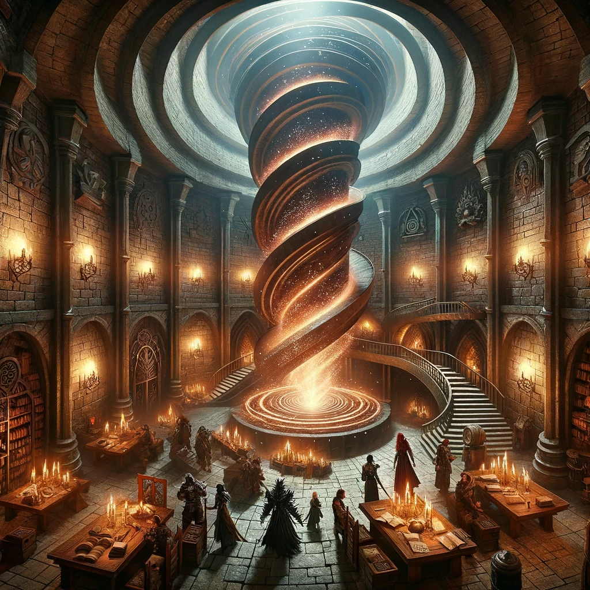

# git 

In the heart of a tempest that never knew peace, there stood an edifice of awe and dread, The Cyclonic Spire. It rose like a spear thrust into the heavens, a monolith of dark stone that defied the chaos of the storm surrounding it. This was no ordinary tempest, but a perpetual maelstrom, a titan of wind and fury that had raged since time immemorial, a sentinel for the most fearsome prison ever conceived.

The Spire was a masterpiece of paradoxes, a place of confinement set in the vast openness of the storm's eye. Here, the world was eerily still, the silence a stark contrast to the cacophony just beyond the walls. The eye was a world unto itself, a sphere of calm around which the eternal storm raged. It was said that the Spire harnessed the storm's power, the winds themselves acting as both warden and guardian.

From a distance, the Spire appeared as a silhouette, a shadow amidst the blinding wrath of the storm. Lightning illuminated its form in brief, stark flashes, revealing glimpses of its grandeur and terror. The structure was impossibly tall, its apex lost in the roiling clouds above, as if it were a bridge between the earth and the tumultuous heavens.

The walls of the Spire were crafted from a material darker than the basalt heart of a mountain. They absorbed light, giving the prison a quality of a void in the visual symphony of the storm. The stone was not merely chosen for its strength but for its properties that were arcane, rumored to be imbued with ancient spells that reinforced its structure against both the elements and any who would attempt to breach its defenses.

Around the Spire, the winds served as a relentless sentinel. They howled with the voices of a thousand lost souls, a cacophony that was both a warning and a lamentation. These were not ordinary gales but currents of air woven with magic, a barrier that no physical entity could penetrate. The winds tore at the fabric of reality, a vortex of such power that it could shred the wings of birds and the hulls of skyships with equal ease.

The eye of the storm was a vast expanse, miles across, and within it, the Spire stood solitary. The base of the tower was surrounded by a courtyard of stones, each one placed by a magic long forgotten, forming intricate patterns that pulsed with a faint light. This was the only illumination within the eye, a ghostly glow that cast long, dancing shadows across the ground.

The interior of the Spire was a labyrinth of corridors and cells, each designed not just to confine but to suppress. The air was thick with the power of containment spells, a tangible pressure that weighed on the spirit as much as the body. The cells were arranged in spirals, mirroring the storm outside, a mimicry that was said to enhance the magic of the place.

The prisoners of the Cyclonic Spire were as unique as their jail, beings of immense power or danger, entities that could not be held by conventional means. Some were warlords whose rage could ignite the very air, sorcerers with knowledge so dark that it corrupted all it touched, creatures from the nether realms whose presence was anathema to life.

The pinnacle of the Spire was home to the most guarded secret of the prison, the control chamber. Here, the warden and their acolytes maintained the spells, a symphony of incantations that required precision and immense power to sustain. The chamber was a nexus of magic, the magical geography that crisscrossed the Cyclonic Spire, converging at the Spire to create the perfect prison.

The Cyclonic Spire was not without its legends. Tales whispered of escapes attempted and failed, of heroes and villains who had tried to conquer the storm. They spoke of the warden, a figure as mysterious as the Spire itself, whose will was said to be as unyielding as the walls of the prison.

In the world beyond the storm, the Spire was a legend, a warning, a symbol of ultimate containment. It was the pinnacle of fear and respect, a testament to the lengths to which civilization would go to contain the uncontrollable. The Cyclonic Spire, with its eternal storm, stood as a monument to power, order, and the indomitable will to maintain both in the face of chaos.

## The interior

Within the Cyclonic Spire, the interior unfurled like a scroll of ancient and arcane architecture, a testament to the ingenuity and perhaps the madness of its creators. The walls, lined with the same dark stone as the exterior, were etched with runes that shimmered with a spectral light, casting an otherworldly glow upon the narrow corridors. These runes were not merely decorative; they were functional components of a complex magical ecosystem, pulsating with the energy drawn from the storm outside.

The air within was thick, charged with a palpable tension that seemed to hum along the spine, a constant reminder of the Spire's true purpose. The corridors twisted inward, like the shell of a nautilus, leading to the heart of the Spire where the most dangerous of all prisoners were kept. The design was intentional, a physical manifestation of the labyrinthine complexity of the spells that protected the place.

The floors were made of slabs of the same oppressive stone, laid so precisely that not even the whisper of a seam could be felt underfoot. The ceilings arched high above, lost in shadows that seemed to absorb the very substance of light. Here and there, the stone gave way to grates that looked down into unfathomable depths, where the energy of the storm was funneled and controlled, a symphony of elemental fury that powered the Spire's defenses.

Cells lined the inner walls of the Spire, each one sealed with doors of heavy iron, embossed with sigils of binding and containment. These doors were not meant to be opened often, for what lay within was meant to be forgotten by the world. The cells themselves were marvels of magical engineering, each one a pocket dimension, crafted to the specific needs of containing its occupant. Some were vast open spaces with skies that mirrored the storm outside, for prisoners who could not be confined by mere walls. Others were voids of sensory deprivation, for those whose power lay in their perception of the world.

The air within the cells was often altered; some were thick with heat, others bore a chill that could freeze the marrow, and some were filled with a silence so deep that it drowned out all thought. The magic of the Spire ensured that each prisoner's abilities were neutralized, their strengths turned against them in their confinement.

At the core of the Spire lay the central chamber, a vast circular room with a floor that acted as a map of the Spire itself. Here, the warden and their acolytes could monitor every cell, every corridor, every inch of the prison with a mere glance. Above, a skylight opened directly to the eye of the storm, a column of calm air that connected the heart of the Spire to the heavens.

The central chamber was the nerve center of the Spire, where the flows of magic were directed and controlled. It was here that the warden could tighten or loosen the grip of the spells that held the prisoners, could dampen or amplify the energies that powered the Spire. The chamber was lined with artifacts of power, each one contributing to the balance of the magical forces at play.

The Spire was not without its own legends and ghosts. It was said that the spirits of those who had built it, who had poured their souls into the stones, still walked the corridors. Whispered conversations would sometimes be heard in the dead of night, the clank of chains, the sigh of a door swinging on unseen hinges. These were the echoes of the Spire's dark history, the remnants of lives spent in the shadow of the storm.

In the Cyclonic Spire, time moved differently, the storm outside a constant reminder of the world beyond reach. The interior was a place out of time, a dance of shadow and light, magic and stone, a prison as much for the mind as for the body.

The wardens and guards of the Cyclonic Spire led lives that were as much a part of the prison as the stones and spells themselves. Their existence was a tapestry woven with threads of duty, vigilance, and an unyielding stoicism in the face of the extraordinary.

For the wardens, their role was not merely a job but a sacred charge. They were the chosen few, individuals who had proven themselves capable of withstanding the psychological rigors that came with such power and responsibility. The wardens were scholars of arcane knowledge, masters of the esoteric arts that governed the Spire. Their days were consumed by the study and maintenance of the complex magical systems that kept the Spire operational and secure. They walked the corridors with a sense of purpose, their eyes reflecting the weight of their office.

The wardens' connection to the Spire was more than physical; they were bound to the prison by powerful oaths and enchantments that linked their life force to the stability of the magical constructs. A warden could sense disturbances within the Spire's walls, could feel the ebb and flow of the magical currents as surely as one feels the beating of one's own heart. Their minds were constantly attuned to the hum of the Spire, to the silent songs of the runes, and to the whispers of the storm outside.

The guards, on the other hand, were the sinew and muscle of the Spire's operations. Selected for their fortitude and loyalty, they patrolled the corridors with a vigilance that never waned. Their armor was no ordinary metal but an alloy forged with alchemical components and enchantments to protect them from the various dangers that their charges could present. Each guard carried a talisman, a focus for the protective spells that shielded them from the direct influence of the prisoners' abilities.

Life for the guards was a strict regimen of patrols, inspections, and drills. They trained to respond to any possible breach or uprising, their reactions honed to instinctual precision. The guards were not just warriors; they were custodians of a peace that was as fragile as it was essential. They knew the patterns of the Spire as one knows the lines upon their own hands, could navigate its labyrinthine passages with their eyes closed.

The camaraderie among the guards was a bond forged in the crucible of shared duty. They ate together in the mess hall, a room with walls of storm-glass that allowed them to gaze upon the tempest outside as they shared their meals. Their conversations were often muted, the gravity of their charge a constant presence at the table. Yet, in their shared glances and the clasp of hands, there was a fraternity that went beyond words.

For both wardens and guards, the moments of respite were few. The Spire offered little in the way of leisure, its very nature anathema to relaxation. The common rooms were sparse, functional, with views of the storm that served as a reminder of the isolation of their posting. Yet, in these spaces, they found their own ways to unwind, be it through quiet contemplation, the reading of tomes, or the sharing of stories from their lives before the Spire.

Despite the austerity of their lives, there was a pride that came with serving in the Cyclonic Spire. They were the unseen bulwark against chaos, the silent sentinels who stood watch over threats unimaginable. Their sacrifices were known only to a few, their vigilance a silent anthem to order and protection.

And so, the wardens and guards wove their own stories into the fabric of the Spire, a element in the midst of the storm's fury and the cold precision of the prison's magic. They were the heartbeat within the stone, the warmth within the cold, the steadfast human spirit enduring within the Cyclonic Spire.

## Zenith of the Cyclonic Spire
At the zenith of the Cyclonic Spire, beyond the reach of the tempest's wrath and the prying eyes of the world, there lay a cell unlike any other. This was the sanctum of Aelar the Galeweaver, one of the legendary Eldarim, whose mastery over the winds was such that her breath could summon gales and her whispers could still the fiercest storms.

Aelar's cell was a marvel of magical architecture, a space that defied the conventional notions of confinement. The chamber was circular, with walls that soared to a domed ceiling crafted from a mosaic of storm-glass, a material that revealed the roiling tempest outside yet shielded her from its fury. The storm-glass was enchanted to contain Aelar's formidable powers, each shard a fragment of a larger spell that bound her to the Spire.

The floor of the cell was a masterpiece of elemental artistry, an intricate array of tiles that depicted the dance of the winds, a homage to the power that Aelar once wielded with impunity. These tiles were not mere stone but living enchantments that responded to Aelar's presence, glowing with a soft light that pulsed in time with her heartbeat.

At the center of the cell stood a dais, upon which Aelar was bound by chains forged from the core of a fallen star. These chains were not just physical restraints but conduits for a network of spells that siphoned her celestial energy, preventing her from drawing upon the full extent of her powers. The chains glimmered with an ethereal light, their links inscribed with runes that hummed with a silent song of containment.

Despite the beauty of the chamber, it was a prison nonetheless. The air was thick with the scent of ozone, a byproduct of the magical barriers that insulated the cell. The ambient magic in the air was a tangible thing, a pressure that settled on the skin and whispered of the raw power that once flowed through Aelar's veins.

The Eldarim was a solitary figure within this grand prison, her form both ethereal and imposing. Her skin bore the luster of the moon, and her eyes held the depth of the night sky. Her hair flowed like liquid silver, spilling over her shoulders and cascading down the dais. Aelar's garments were of a fabric that shimmered with the colors of the dawn, a cruel reminder of the skies she could no longer touch.

Around her, the cell was adorned with shimmering illusions relics of her past, objects of power that had once been hers to command. A staff inlaid with sapphires that mirrored the sky, a tome bound in the hide of a storm-drake, its pages filled with the secrets of the winds. These items lay just beyond her reach, a taunt for the power she could not wield within her bonds.

The magic that held Aelar was a complex symphony, each spell interlocking with the next to create a harmony of imprisonment. The wardens who tended to her cell were the finest of their order, trained to maintain the delicate balance of forces that kept the Galeweaver contained. They moved with a reverence and a fear, for they knew that the being before them was not just a prisoner but a force of nature made flesh.

Aelar's existence in the Spire was one of silent contemplation and smoldering defiance. She spoke little, her voice a melody that resonated with the magic of her cell. Her eyes often turned skyward, to the storm that raged beyond her reach, a storm she had once commanded with a mere thought.

In the stillness of her cell, Aelar the Galeweaver waited, her power leashed but unbroken. The Eldarim's spirit remained indomitable, a flicker of hope that one day the winds would once again heed her call, and the skies would open to welcome her home.

