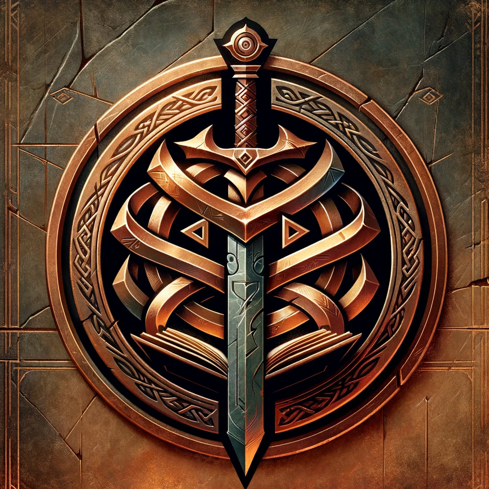

# Dagnath: The Dwarven Deity of Death and Knowledge

Dagnath is envisioned as a deity revered by dwarves, embodying the dual aspects of death and knowledge within a fantasy lore. Her followers are characterized by their valor and wisdom, reflecting the goddess's domains. They are not mere warriors but also guardians of their race's history and seekers of esoteric truths.

****
## Alignment
**Alignment:** Neutral or Lawful Neutral. Given her dual aspects of death and knowledge, Dagnath likely embodies a balanced or orderly approach. Death is a natural, inevitable part of life, and her focus on knowledge suggests a structured, perhaps even scholarly approach to the world.
## Portfolio
**Portfolio:** Death, Knowledge, Ancestral Legacy, Protection of Heritage. Dagnath represents the inevitable end that comes to all, but also the wisdom and knowledge gained through lifetimes. Her portfolio includes the safeguarding of history and cultural heritage, particularly through runes and ancestral legacies.
### Domain
**Domains:** Death, Knowledge, War (due to her warriors), Rune. The domain of Death aligns with her aspect as a deity of the end of life, Knowledge for her scholarly and wisdom aspects, War due to her followers who are often valorous warriors, and Rune, reflecting her unique connection to runes as vessels of heritage and power.
### Worshipers
**Worshipers:** Dwarves primarily, especially those who are warriors, scholars, historians, and guardians of cultural legacies. Her worshipers are likely characterized by their respect for the past, their dedication to preserving knowledge, and their preparedness for the inevitabilities of death.
## Symbol
**Symbol:** 

***

## Rune and Ancestral Legacy

The lore around Dagnath heavily features runes, which are more than mere weapons; they are vessels of heritage, possibly containing the spirits or legacies of dwarven ancestors. The recovery and safeguarding of these swords are sacred tasks entrusted to Dagnath's followers, signifying the intertwining of death, memory, and the preservation of knowledge.

## Servants' Duties

Those devoted to Dagnath are depicted as undertaking journeys beyond their traditional homelands to reclaim these ancestral relics. This duty underscores a broader scope of Dagnath's influence, suggesting her reach extends into the realms of adventure and the safeguarding of dwarven culture across various lands.

## Cultural Significance

Dagnath's worship likely has a profound impact on dwarven culture, shaping their perceptions of death as a passage intertwined with the acquisition of knowledge and the remembrance of the past. The emphasis on the recovery of rune swords highlights a societal reverence for lineage and the continuity of their people's narrative.

## Interactions with Other Races

The lore implies that Dagnath's followers might engage with other races, such as elves, in their quest. This suggests a broader narrative where dwarven deities and their servants interact with the wider world, potentially influencing and being influenced by the cultures and traditions of other races.
