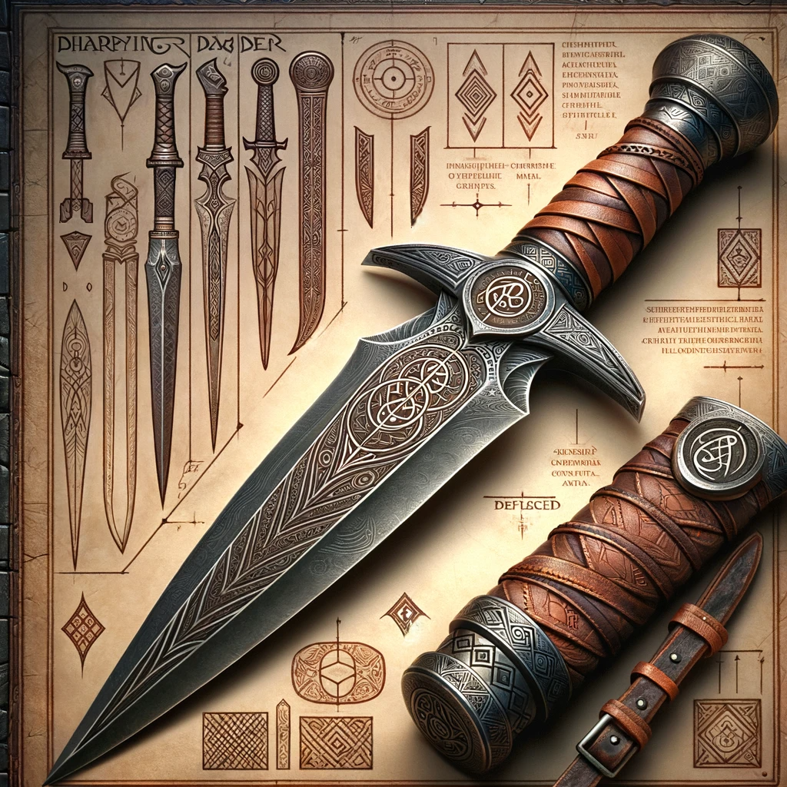

# Rune of Dharzil Guard

**Combining**: "Dharzil" (a Dwarvish-inspired word that conveys "defense" or "shielding") with "Guard" (indicating protection and defense).

## Short description
The sword can parry attacks, granting an armor class bonus when wielded.
## Effect
When wielding a sword with this rune you get bonus yo you class bonus equal to +1 for every 3 point remove for your to hit

## Game rules
**Rune Difficulty:** +0 (no additional difficulty for inscribing this rune).
**Rune Rarity:** Common
**Effect Variation Based on Location:**
- Location 1-5:
    - Can parry attacks by transferring the sword's enhancement bonus to AC on 1 for 1  basis.
- Locations 5:
    - Can parry attacks by transferring the sword's enhancement bonus to AC on 1 for 2  basis.

## The Legend of the Dharzil Guard Rune

In the annals of Dwarvish history, within the fortified walls of the citadel of Shieldrend, the art of defense was as revered as the art of the offense. Battles were often won not by the might of the blow but by the strength of the parry.

In this backdrop, a determined Dwarvish runesmith named **Torin Shieldbearer** emerged. He believed that a warrior's true strength lay not in how many foes he could strike down, but in how many blows he could deflect and comrades he could protect.

Through a combination of alchemical experiments, metallurgical innovations, and runic inscriptions, Torin forged a rune that bestowed upon a blade the capability to function as a shield, parrying attacks and bolstering the wielder's defense. This marvel was christened the *Dharzil Guard*. Blades imbued with this rune not only cut through foes but also deflected their onslaughts, making their wielders near-impenetrable.

As tales of the Dharzil Guard spread, it rapidly ascended to legendary status. Dwarven warriors wielding these enhanced blades were lauded as the ultimate guardians, their very presence on the battlefield reassuring allies and instilling fear in adversaries. The gleam of the rune became synonymous with unyielding defense and unbreakable resolve.

Understanding the immense strategic advantage offered by the Dharzil Guard, the Shieldbearer clan took it upon themselves to guard its secrets with their lives. The Rune of Dharzil Guard stands as a monument to Torin Shieldbearer's vision and the enduring Dwarvish belief that the best offense is a stalwart defense.

## Description of Creator
The creator of the Rune of Dharzil Guard, Torin Shieldbearer, was a master runesmith known for his exceptional skill and deep understanding of ancient Dwarvish lore. His stout build, typical of Dwarven kind, was complemented by a thick, braided beard, a hallmark of his esteemed lineage. Torin's eyes, sharp and bright like polished steel, reflected a mind that was always contemplating the next innovation. His hands, though rough from the forge's heat, were remarkably precise, capable of inscribing runes that seemed to dance with magical energy.

Torin's reputation was not solely built on his craftsmanship but also on his philosophy that the protection of kin and kingdom was paramount. His garments often bore the emblem of the Shieldbearer clan—a shield cleaved by a sword, symbolizing the balance between attack and defense. It was said that his workshop was filled with sketches of runes and designs of swords that lined the stone walls, illuminated by the ever-burning glow of his forge.

His work with the Dharzil Guard rune was a testament to his legacy, a blend of practical skill and an almost philosophical belief in the sanctity of defense. Torin Shieldbearer was not only a runesmith but a protector of Dwarvish values, a creator whose life's work was to empower his people through the art of the forge and the wisdom of the rune.