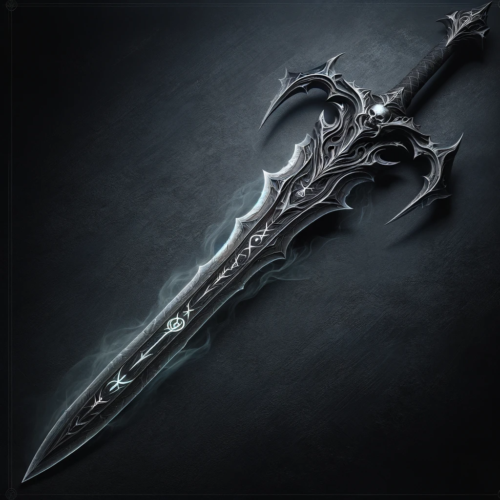
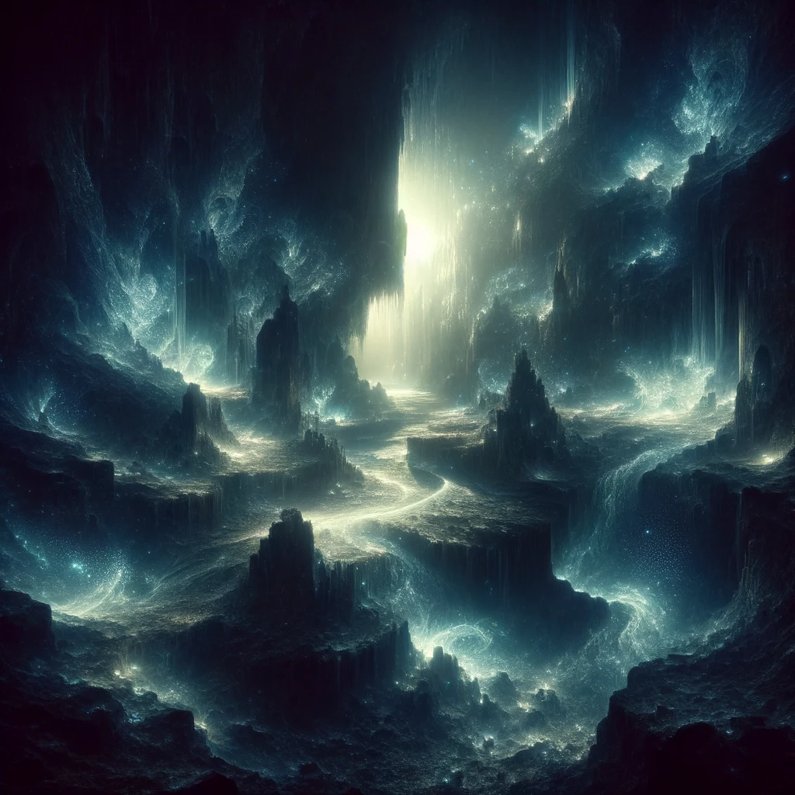
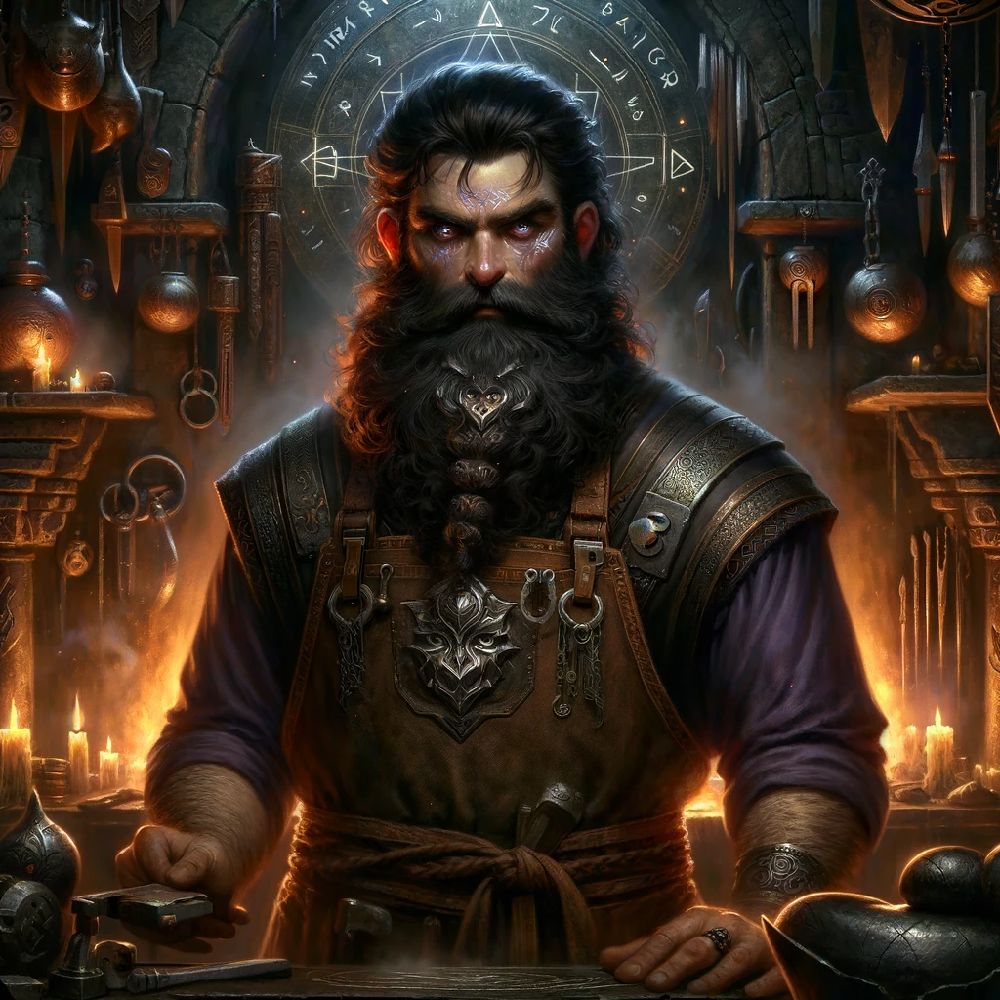

# Rune of Myrkrstinga

**Combining:** 
"Myrk" (a word hinting at "darkness" or "shadow")
"Stinga" (suggesting "sting" or "pierce" in the context of a weapon).

## Effect
The sword deals harmful energy damage, weakening the target's strength on successful hits.

### Game rules
**Rune Difficulty:** +10 (no additional difficulty for inscribing this rune).
**Rune Rarity:** Very Rare

**Effect Variation Based on Location:**
- **Location 1-2:**     
    - N/A.
- **Location 4:**
    - Causes 1d4 damage to strength. (1 day)
- **Location 4:**
    - Causes 1d6 damage to strength. (1 week)
- **Location 5:**   
    - Causes 1d8 damage to strength. (1 month)
- **Location 6:**     
    - Causes 1d12 damage to strength. (1 year)

## The Legend of the Myrkrstinga Rune
In the deep, uncharted caverns of the Gloompeak Mountains, the Dwarven clan of Shadowforge found solace. Their expertise lay in crafting weapons that thrived in darkness, unlike any other in the realm.

Among these skilled artisans was Thrain Shadowhand, a blacksmith whose creations were as enigmatic as the shadows he loved. Thrain's ambition was to forge a weapon that thrived in darkness and embodied it.

One night, under a sky void of stars, Thrain ventured deeper into the Gloompeak caverns than any Dwarf had dared. He stumbled upon a rare crystal, pulsating with dark energy—The Heart of Shadows. Inspired, he began his most remarkable work, infusing this essence into his most finely crafted blade.

However, the Heart of Shadows' energy proved too wild, draining life from everything around it. Undeterred, Thrain poured over ancient texts and forgotten runes. His perseverance led to the creation of the Myrkrstinga Rune, which harnessed the dark energy, allowing the blade to release its power only upon striking its target.

The legend of Thrain's creation spread far and wide, making the Myrkrstinga Rune a symbol of feared power, revered by those who embrace the darkness.

## Description of Creator
Thrain Shadowhand's forge was a place of mystery, nestled deep within the heart of the Gloompeak Mountains. His appearance mirrored his work—hair and beard as dark as the ore he smelted, eyes gleaming with the secrets of the depths. Thrain was more than a blacksmith; he was a visionary who saw beauty in darkness and potential in the unknown.

Raised amidst the echoes of hammers and anvils, Thrain’s skills were honed in the shadows of the mountain. His father, a renowned smith, taught him the traditional ways, but Thrain's heart was drawn to the unexplored and the mystical. He was a master of blending the old with the new, creating weapons that were functional and embodiments of the dark magic he so revered.

