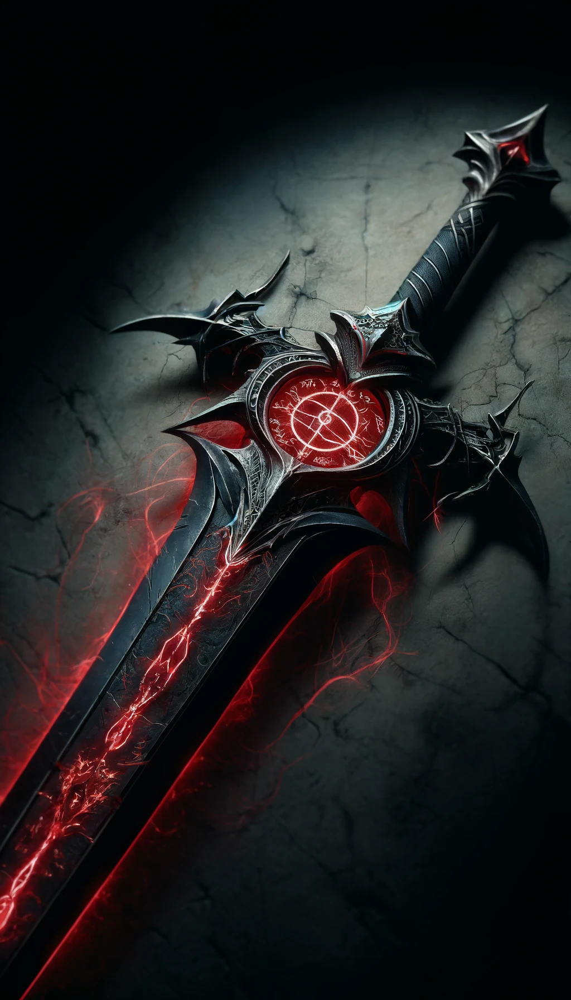
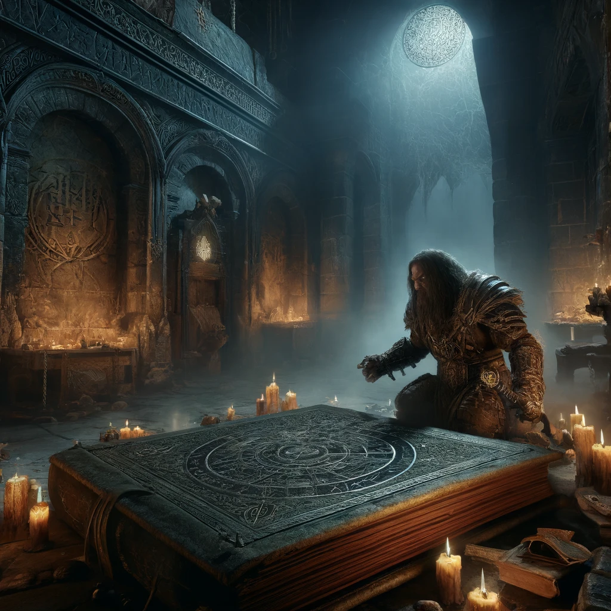
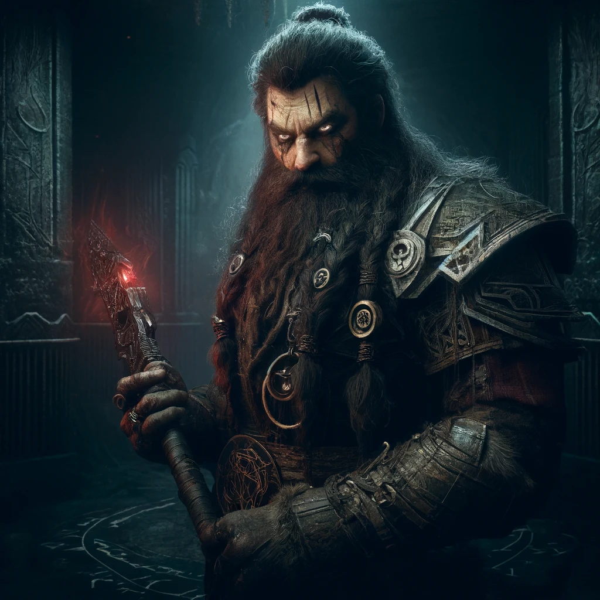

# Rune of Varrum-Tor

**Combining**
- **"Varrum"** (Dwarvish for 'soul')
- **"Tor"** (Dwarvish for 'torment')

## Effect
The sword becomes sentient, filled with malevolent intelligence. It seeks to dominate its wielder, urging dark and destructive actions. The sword's alignment is always evil, and it grants increased power at a terrible cost.

### Game Rules
- **Rune Rarity:** Legendary
- **Rune Difficulty:** +20
- **Effect Based on Location:**
  - **Location 1:**  The Sword becomes sentient, filled with malevolent intelligence
  - **Location 2-7:** Cannot be added to these locations.
- **Dark Whisper Effect:** The sword constantly whispers to its wielder, attempting to influence their actions. The wielder must make a Wisdom saving throw (DC = 15 + rune difficulty) at the end of each long rest. On a failure, the wielder feels an overwhelming urge to commit an evil act, as suggested by the sword.

## Visual
A dark and ominous blade with a jagged edge, pulsating with a sickly red glow. The hilt is wrapped in blackened iron, adorned with a sinister rune circle that emanates an eerie crimson light. Faint whispers seem to echo from the blade, hinting at the tortured soul within.

## The Legend of the Varrum-Tor Rune

Deep within the shadowy depths of the ancient Dwarven stronghold of Khazad-Nol, a forbidden ritual was performed in secrecy. Only the most desperate and corrupt of the Dwarven kin dared to attempt it, known as the Ritual of Varrum-Tor. The legend speaks of a time of great despair, when the Dwarves faced annihilation from an overwhelming enemy. A rogue clan, led by the dark-hearted Thrain Bloodsorrow, sought power at any cost to save their people—or so they claimed.

In a hidden chamber, Thrain and his followers captured the souls of their enemies, binding them into weapons using a dark and twisted rune. The result was the creation of the Varrum-Tor rune, a mark of unspeakable torment and power. Each sword crafted with this rune became sentient, filled with the malevolence of the trapped soul, always seeking to corrupt and destroy.

The Dwarves soon realized the true cost of this forbidden magic. The wielders of these dark blades became monstrous, their hearts twisted by the malevolent whispers of the soul within. The Dwarven council declared the rune heretical, its use punishable by death, and sought to destroy every weapon tainted by the Varrum-Tor.

Yet, whispers persist of these cursed blades, hidden away in dark places, waiting to be found by the unwary or the power-hungry. The Dwarves remain ever vigilant, ready to eradicate these abominations should they resurface.

### Description of Creator
Thrain Bloodsorrow was once a respected Dwarven warrior, known for his fierce determination and cunning in battle. However, the endless wars and the looming threat of annihilation drove him to seek darker powers. Consumed by the desire to save his kin at any cost, Thrain delved into forbidden lore and uncovered the secrets of soul-binding.

Driven by desperation and a twisted sense of duty, Thrain performed the Ritual of Varrum-Tor, creating the first of the cursed soul swords. His actions, though initially successful in turning the tide of battle, brought doom upon his clan. Thrain himself fell victim to the whispers of his own creation, his soul forever bound to the very weapon he had forged.

The legacy of Thrain Bloodsorrow serves as a grim reminder of the dangers of unchecked ambition and the dark path of forbidden magic. His name is spoken with a mixture of fear and revulsion among the Dwarves, a cautionary tale of power gained at too great a cost.

