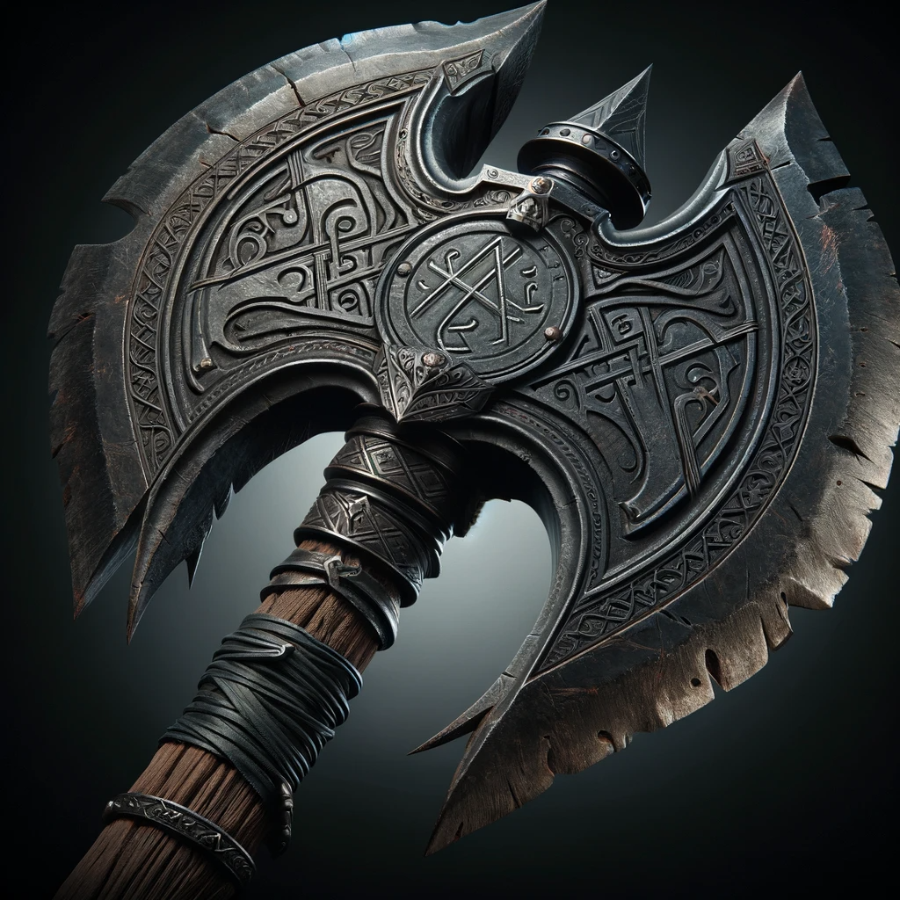
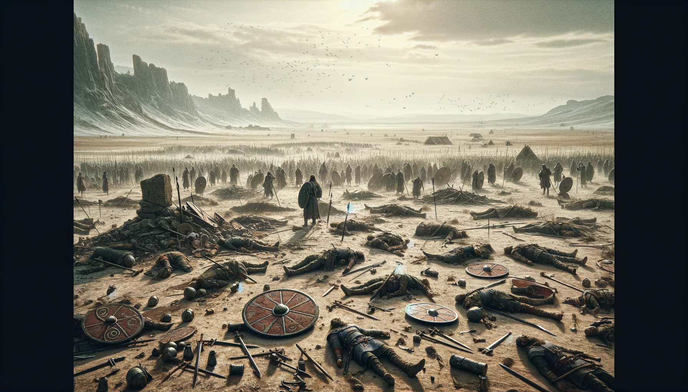
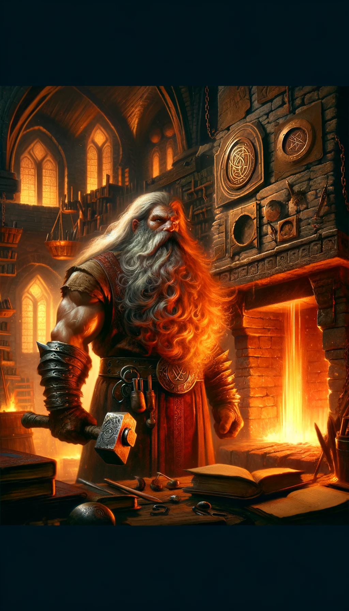

# Rune of Vordal Lifedrinker

**Combining**: "Vordal" (a Dwarvish-inspired term that conveys "absorption" or "siphoning") with "Lifedrinker" (indicating a weapon's power to drain life force).

## Effect

The sword drains the life force of foes, healing the wielder with each hit.

## Visual

The rune itself is a haunting amalgamation of Dwarvish sigils. It depicts a central vortex, symbolizing the siphoning of life. Spiraling outwards from this vortex are delicate tendrils, reaching and intertwining, evoking the image of life forces being drawn in. The outer edge of the rune is encased in a jagged boundary, representing the raw power and danger of this life-draining ability. When inscribed on a blade, the rune seems to pulse with a shadowy glow, as if hungering for the vitality it's designed to steal.

## The Legend of the Vordal Lifedrinker Rune

In the dimly lit depths of the Dwarvish stronghold of Grimvault, where life and death danced a precarious tango, tales whispered of blades with a thirst unquenchable. Weapons not just of steel, but of hunger - a hunger for the very essence of life.

Amid this aura of awe and mystery stood **Balin Bloodforge**, a Dwarvish runesmith with a peculiar fascination for the balance of life. Intrigued by tales of vampiric creatures and life-siphoning sorceries, Balin endeavored to channel such power into the very core of a blade.

Through a mix of forbidden rituals, esoteric rune-crafting, and sheer determination, Balin successfully forged a rune that could imbue a blade with the eerie ability to drain life. He named this haunting creation the *Vordal Lifedrinker*. Swords engraved with this rune seemed alive, their strikes draining the vitality of foes and transferring it to their wielders.

The legend of the Vordal Lifedrinker spread like wildfire. Dwarven warriors wielding these insatiable blades became both revered and feared, their wounds healing as they felled their adversaries. The haunting glow of the Lifedrinker rune became a beacon of dread on the battlefield.

But with such predatory power came the weight of responsibility. The Bloodforge clan, realizing the dangers of wielding and misusing the Lifedrinker, guarded its secrets with an intensity that matched the rune's thirst. Today, the Rune of Vordal Lifedrinker stands as a chilling testament to Balin Bloodforge's brilliance and the thin line between life and death in the heart of the mountains.

## Description of Creator

In the cavernous deeps of the Dwarven city of Ironhold, amidst the ceaseless clang of hammer on anvil, there lived a runesmith known as Balin Bloodforge. Unlike his brethren, who sought to forge weapons of mere steel and flame, Balin harbored a fascination with the ethereal and the arcane. His mind was as much on the pages of ancient tomes as on the heat of the forge.

Balin was of stout build, with a beard like flowing magma and eyes that glinted like sapphires in the forge light. He believed that a warrior's weapon should be an extension of their soul, and so he delved into the forbidden arts, seeking to infuse his creations with the essence of life itself.

The legend of Balin began in the aftermath of the Battle of Black Mountain. As the dust settled and the crows feasted, Balin walked the desolate battlefield. The sight of weapons, discarded and forgotten, sparked a revelation in him. He envisioned a blade that did not merely take life but consumed it, channeling the vitality of the fallen to the wielder.

Balin returned to his forge with a heavy heart and a resolute spirit. Through a melding of alchemy, runecraft, and secret rituals known only to him, he birthed the Vordal Lifedrinker rune. The rune bore the mark of the vortex, symbolizing the unending cycle of life and death, and Balin etched it upon a blade he named Grimharvest.

Whispers of Balin's creation echoed through the halls of Ironhold. Warriors sought him out, yearning for the power of the Lifedrinker. But Balin saw the greed in their eyes and knew the peril such power could bring. Thus, he kept the true might of his runes hidden, bestowing them only upon those whose hearts were as pure as the metals he worked.

The story of Balin Bloodforge endures, a tale of a smith who touched the very essence of life, binding it to cold steel. His name is spoken with reverence and caution, a reminder that even in the depths of the earth, the line between creation and destruction is as thin as the edge of a blade.