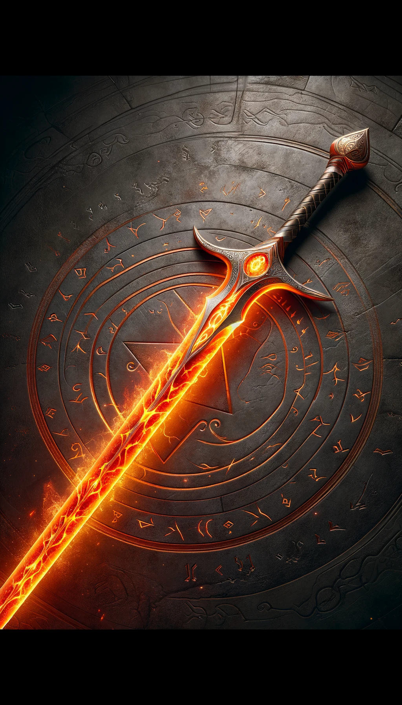
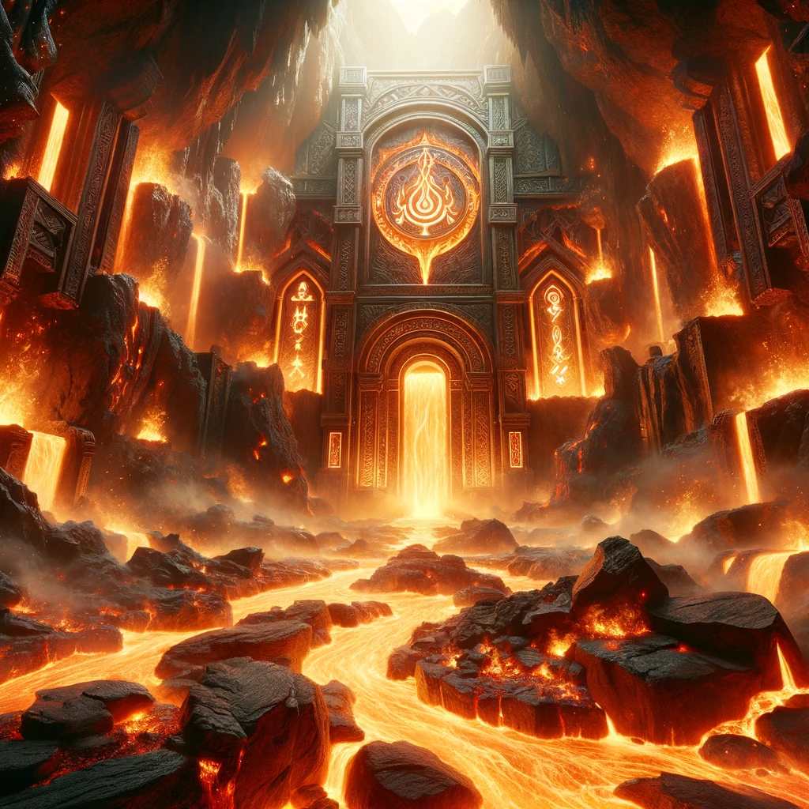
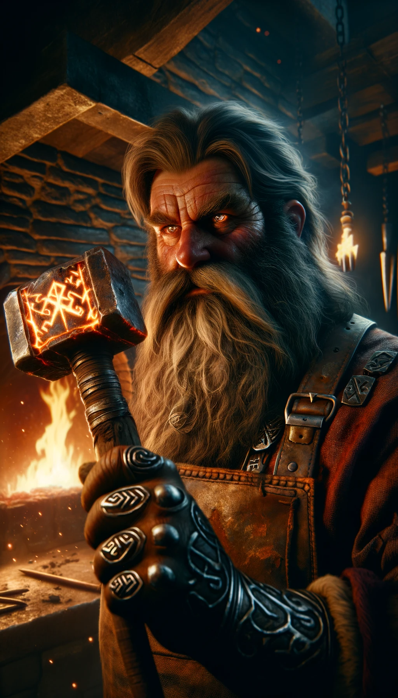

# Rune of Eldhrun

**Combining** 
- "El" (an invented root reminiscent of "ember" or "elusive flame")
- "Dhrun" (a Dwarvish-sounding word that could be used to imply "rune" or "mark").

## Effect 
The sword bursts into flames when drawn, dealing extra fire damage on successful hits.

### Game rules
**Rune Difficulty:** +0 (no additional difficulty for inscribing this rune).
**Rune Rarity:** Common
**Effect Variation Based on Location:**
- **Location 1:**     
    - Causes an additional 1d4 damage.
- **Location 2-3:**
    - Causes an additional 1d6 damage.
- **Location 4-5:**   
    - Causes an additional 1d8 damage.
- **Location 6:**     
    - Causes an additional 1d10 damage.

## Visual 
A robust forge hammer (representative of Dwarvish craftsmanship) striking an anvil with brilliant sparks flying. From these sparks arises a ferocious flame, spiraling upwards, its warmth and brilliance encased within a protective rune circle.

---

## The Legend of the Eldhrun Rune

Deep within the heart of the Fiery Forge Mountains, where magma rivers flowed like water, the Dwarvish clan of Emberhold thrived. Known for their mastery over fire and metal, these Dwarves crafted weapons that legends were made of.

Among them was Brondar Flamebearer, a blacksmith whose works surpassed the brilliance of even the most seasoned crafters. Yet, Brondar yearned to create a masterpiece—a weapon that would embody the very essence of the fiery mountains.

One fateful night, while forging under the red moon, Brondar noticed a peculiar glow from the lava river. Drawing closer, he discovered a unique stone, bathed in flame yet never consumed—a Fireheart Gem. With unparalleled excitement, Brondar began his grand work, merging the gem's power with his finest blade.

But the raw power of the Fireheart Gem was too volatile; the blade blazed uncontrollably. Determined, Brondar delved into ancient rune lore. After months of relentless effort, he chiseled the perfect rune—the Eldhrun. This rune tamed the Fireheart Gem's fury, allowing the sword to ignite only when drawn and harnessing its full potential upon impact.

Word of the Flamebearer's creation spread like wildfire. Warriors from lands far and wide sought the fiery might of the Eldhrun. The rune became a symbol of unmatched prowess, a legacy of the Emberhold clan and the unyielding spirit of Brondar Flamebearer.

## Description of Creator

In the stout heart of the Emberhold mountains lay the forge of Brondar Flamebearer, a blacksmith whose lineage was as ancient as the tunnels that wound like veins through the stone. Brondar, whose beard was singed at the ends from a lifetime near the flames, was not merely a craftsman; he was an artist who painted in strokes of molten metal and embers.

Born to the sound of hammer on anvil, Brondar's talent was forged in the fire of tradition and tempered in the waters of innovation. He grew up listening to the tales of his forefathers, who had shaped the very halls they lived in, halls that resonated with the echoes of a thousand years. Brondar’s father, Durgan, had been a master smith, but where Durgan saw the forge as a place of work, Brondar saw it as a place of magic.

A prodigy in the eyes of the clan, Brondar was not content with the old ways. He sought to blend the ancient Dwarvish craftsmanship with something greater, something that had never been attempted. His ambitions often led him to the wilder parts of the Emberhold mountains, where he studied the untamed magic of fire in its purest form—lava.

His masterpiece began not with a vision, but with a discovery. During a rare volcanic event, Brondar found a gem that pulsed with an inner light, a heart of the mountain itself. He named it the Fireheart Gem. When he attempted to embed the gem into a blade, he unleashed a power so fierce it could not be contained. The blade burned with a wild fire, untamed and hungry.

Brondar realized that he needed something more than skill to tame such a force—he needed the wisdom of the ancients. He delved into the long-forgotten lore of his people, spending nights that bled into mornings, poring over dusty tomes and faded runes. It was through this relentless pursuit that he crafted the Eldhrun Rune, a symbol of containment and control that harnessed the wild essence of the Fireheart Gem.

The creation of the Eldhrun Rune was more than a triumph of craftsmanship; it was a symbol of the balance between the old and the new, a testament to Brondar's belief that the future of Dwarvish craftsmanship lay not in the repetition of the past, but in the bold march forward. Brondar Flamebearer's name became etched in the annals of history, whispered with reverence as the creator of the Eldhrun Rune—a legacy that burned as brightly as the flames of his forge.