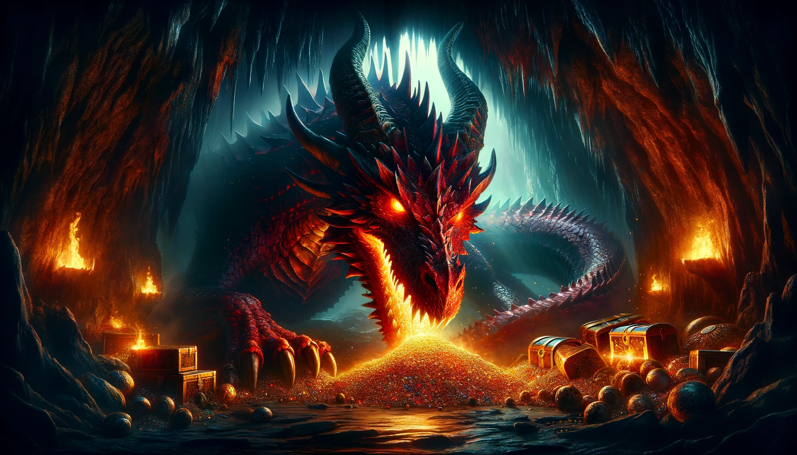
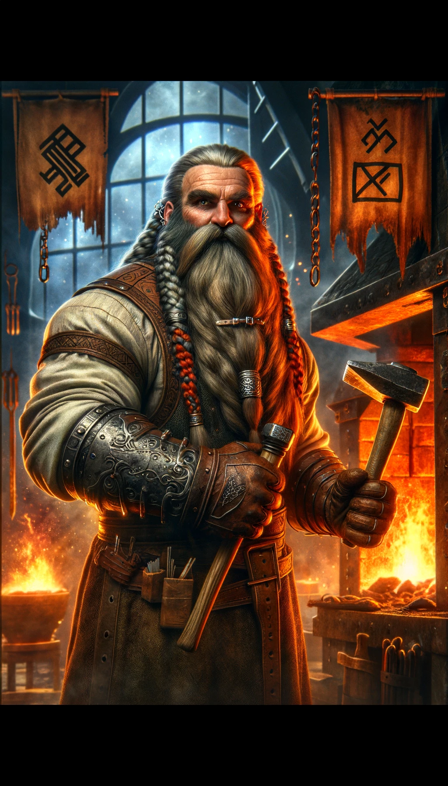
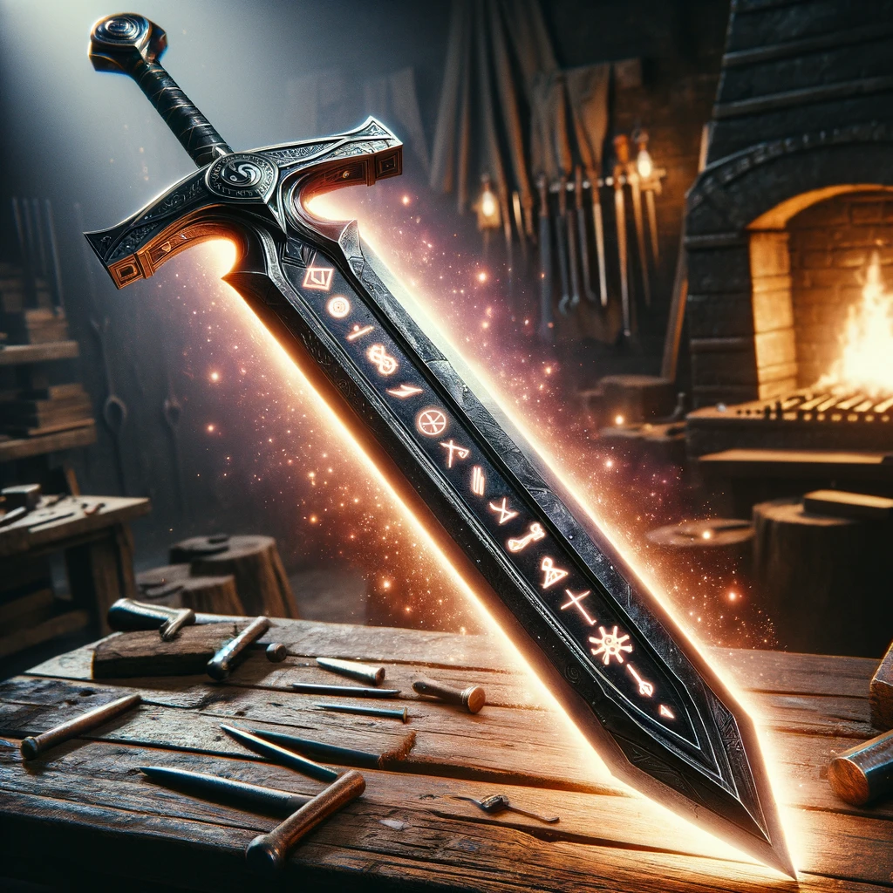

### Rune of Bannsvík

**Combining:**
- "Bann" (Dwarvish for 'curse' or 'bane')
- "svík" (Dwarvish for 'strike' or 'hit')

## Short Description
The sword is especially effective against a specific type of creature (e.g., dragons, undead, or giants).

## Effect
This rune enables the sword to deal extra damage and have heightened effectiveness against a designated type of creature.

## Game Rules
- **Rune Difficulty:** +5 (moderate difficulty for inscribing this rune).
- **Rune Rarity:** Rare
- **Effect Variation Based on Location:**
  - **Location 1:** Effective against a specific creature type chosen at creation.
  - **Location 2:** Effective against a specific creature type, can be changed once per year.
  - **Location 3:** Effective against a specific creature type, can be changed once every six months.
  - **Location 4:** Effective against a specific creature type, can be changed once every three months.
  - **Location 5:** Effective against a specific creature type, can be changed once every month.
  - **Location 6:** Effective against a specific creature type, can be changed once every week.
  - **Location 7:** Effective against a specific creature type, can be changed every 24 hours.

## The Legend of the Bannsvík Rune

In the ancient and war-torn lands of Stonefall, the dwarven runesmith **Baldur Doomhammer** sought to protect his kin from the myriad of monstrous threats that plagued them. Baldur, renowned for his exceptional skills and fierce dedication, aimed to create a weapon that could adapt to the ever-changing dangers his people faced.

His inspiration came during a brutal encounter with a dragon that had ravaged his village. Realizing that a single weapon with the power to combat different creatures was essential, Baldur set to work. After years of tireless effort and numerous trials, he succeeded in creating the Rune of Bannsvík, a rune that imbued a weapon with the ability to be exceptionally effective against a designated type of creature.

The Rune of Bannsvík quickly became a legendary artifact among the dwarves, providing them with a powerful tool to combat their foes.

## Description of Creator

Baldur Doomhammer was a towering figure among the dwarves, known for his unyielding determination and unmatched craftsmanship. With broad shoulders, a long, braided beard, and eyes that gleamed with an inner fire, Baldur was a formidable presence. His forge was a testament to his life's work, filled with weapons, runes, and artifacts that bore the mark of his exceptional skill and dedication to protecting his people.

## Visual Representations

### First Weapon with the Rune
A sword with dark metal and glowing runes that radiate a powerful, ominous light. The blade is etched with symbols representing various creatures, symbolizing its adaptable power.

### Inspiration for the Rune
A scene of devastation caused by a dragon attack, with Baldur standing resolute amid the ruins, determined to create a weapon that could prevent such tragedies.

### The Creator
Baldur Doomhammer, depicted in his forge, surrounded by glowing runes and weapons, with an intense and focused expression as he inscribes the Rune of Bannsvík onto a sword.