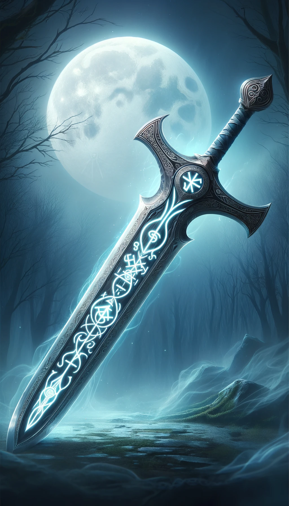
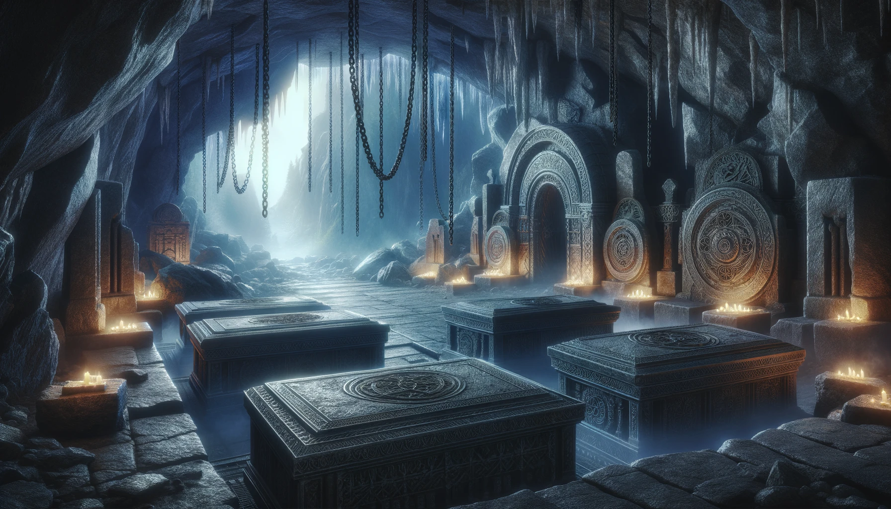
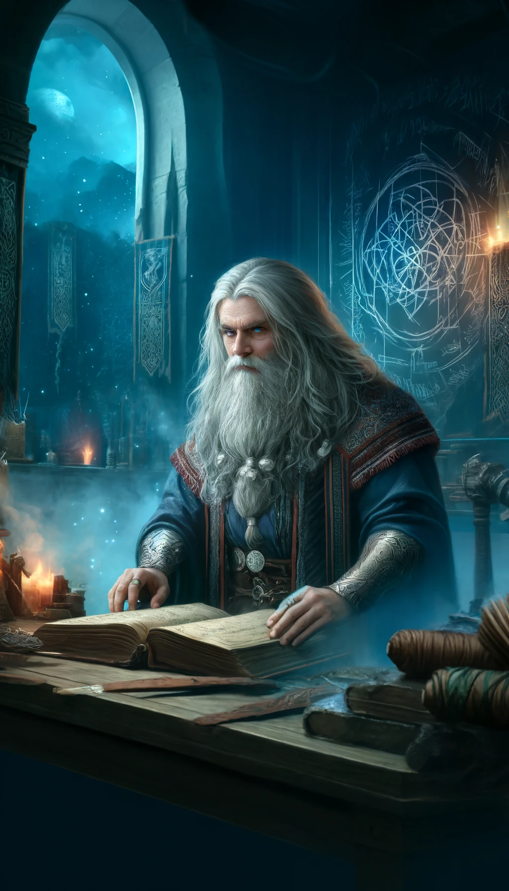

### Rune of Draugr-Keðja

**Combining:**
- "Draugr" (Dwarvish for 'ghost' or 'spirit')
- "Keðja" (Dwarvish for 'chain')

## Short Description
The sword can bind ethereal or spectral creatures, preventing them from phasing out.

## Effect
This rune enables the sword to ensnare and hold ethereal or spectral entities, disrupting their ability to phase through physical matter.

## Game Rules
- **Rune Difficulty:** +0 (moderate difficulty for inscribing this rune).
- **Rune Rarity:** Uncommon
- **Effect Variation Based on Location:**
  - **Location 1:** Bind ethereal creatures for 1 round.
  - **Location 2:** Bind ethereal creatures for 2 rounds.
  - **Location 3:** Bind ethereal creatures for 3 rounds.
  - **Location 4:** Bind ethereal creatures for 1 minute.
  - **Location 5:** Bind ethereal creatures for 5 minutes.
  - **Location 6:** Bind ethereal creatures for 10 minutes.
  - **Location 7:** Bind ethereal creatures for 1 hour.

## The Legend of the Draugr-Keðja Rune

In the mist-shrouded peaks of the Phantomforge Mountains, the Dwarven clan of Ghosthammer dwelled, known for their unique crafts that often touched the realms beyond. Among them was **Galdur Spiritbind**, a runesmith whose fascination with the ethereal was unmatched.

Galdur's ambition was to bridge the gap between the physical and the spectral realms. He sought to craft a weapon capable of interacting with spirits and ghosts, entities that were otherwise untouchable by mortal hands.

His inspiration came during a moonlit encounter with a wandering spirit in the ethereal forests near his forge. The spirit's inability to interact with the physical world deeply moved Galdur. He pondered over ancient texts and ethereal essences, seeking a way to bind these spectral beings.

After years of dedicated research and countless experiments, Galdur forged the Draugr-Keðja Rune. This rune, when inscribed on a weapon, gave it the unique ability to ensnare spectral entities, preventing them from phasing through matter. It became a beacon of hope for those plagued by restless spirits.

The Draugr-Keðja Rune earned Galdur immense respect and fear. It stood as a testament to his genius and his deep empathy for the unseen and misunderstood spectral beings.

## Description of Creator

Galdur Spiritbind, the creator of the Draugr-Keðja Rune, was a figure of intrigue and reverence. His appearance was as ethereal as his work, with long, silver hair that shimmered like moonlight and eyes that held the depth of the night sky. His tall, slender frame moved with a grace uncommon among Dwarves, often cloaked in robes adorned with symbols of the spectral realm.

## Visual Representations

### First Weapon with the Rune
A sword with intricate rune markings glowing with an ethereal light, appearing almost ghostly in its appearance.

### Inspiration for the Rune
The moonlit encounter with the wandering spirit in the ethereal forests, showing the spirit's translucent form and its interaction with Galdur.

### The Creator
Galdur Spiritbind, depicted in his forge, surrounded by artifacts and tomes, his eyes reflecting his deep connection with the spectral realm.