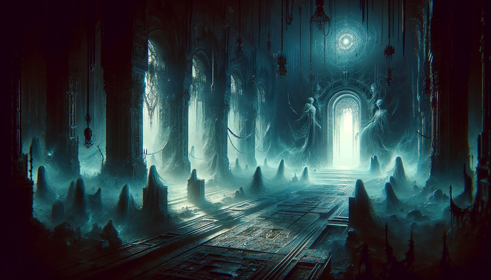
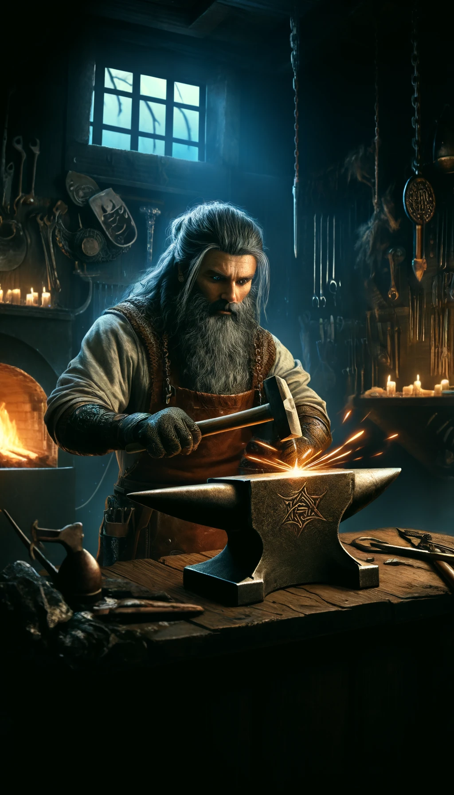
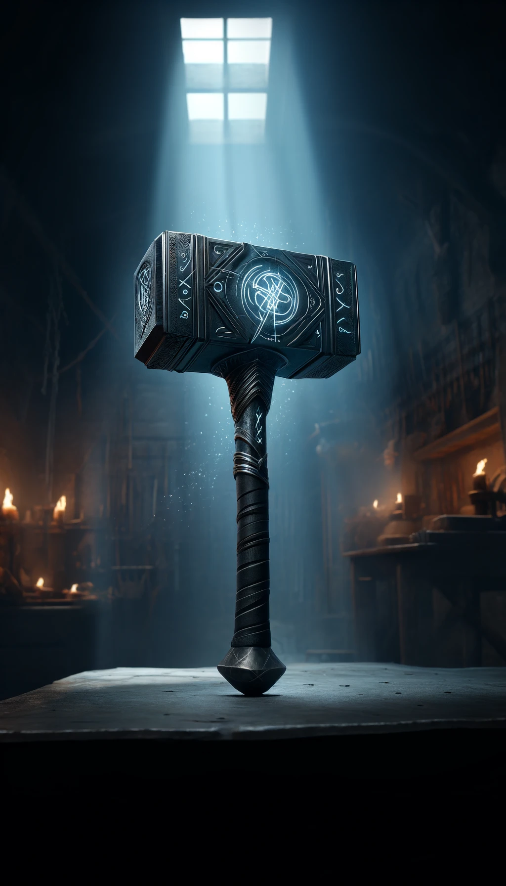

### Rune of Fasthámarr

**Combining:**
- "Fasth" (Dwarvish for 'phase')
- "Hámarr" (Dwarvish for 'strike' or 'hammer')

## Short Description
The warhammer can bypass armor and strike ethereal or incorporeal creatures.

## Effect
This rune enables the warhammer to ignore physical armor and strike creatures that are ethereal or incorporeal.

## Game Rules
- **Rune Difficulty:** +5 (moderate difficulty for inscribing this rune).
- **Rune Rarity:** Rare
- **Effect Variation Based on Location:**
  - **Location 1:** 5% chance to bypass armor, can hit ethereal creatures.
  - **Location 2:** 10% chance to bypass armor, can hit ethereal creatures.
  - **Location 3:** 15% chance to bypass armor, can hit ethereal creatures.
  - **Location 4:** 20% chance to bypass armor, can hit ethereal creatures.
  - **Location 5:** 35% chance to bypass armor, can hit ethereal creatures.
  - **Location 6:** 40% chance to bypass armor, can hit ethereal creatures.
  - **Location 7:** 50% chance to bypass armor, can hit ethereal creatures.

## The Legend of the Fasthámarr Rune

In the shadowy depths of the Forgotten Catacombs, the Dwarven smith **Thrain Shadowstrike** crafted the Rune of Fasthámarr. Thrain, known for his cunning and resourcefulness, sought to create a weapon that could confront foes from beyond the physical realm.

His inspiration came during a harrowing encounter with an incorporeal wraith. Unable to strike the creature with conventional weapons, Thrain dedicated himself to forging a rune that could pierce the veils between the worlds.

After months of research and numerous failed attempts, Thrain succeeded. The Rune of Fasthámarr allowed weapons to bypass physical armor and strike ethereal and incorporeal beings. This rune quickly became revered among warriors facing spectral adversaries.

## Description of Creator

Thrain Shadowstrike was a master smith with a reputation for creating weapons that defied conventional limitations. His forge was a place of dark brilliance, filled with arcane tools and ancient tomes. Thrain himself was a dwarf of medium build, with sharp eyes that seemed to see beyond the material world, and a mane of dark hair streaked with silver. His innovative spirit and relentless pursuit of perfection made him a legend among the Dwarven clans.

## Visual Representations

### First Weapon with the Rune
A warhammer with sleek, dark metal and glowing runes etched into the head, radiating a faint, otherworldly light.

### Inspiration for the Rune
A dark, shadowy chamber filled with ghostly figures and wraiths, where the air feels thick with unseen forces.

### The Creator
Thrain Shadowstrike, depicted in his dimly lit forge, surrounded by glowing runes and ancient artifacts, a look of intense focus on his face.