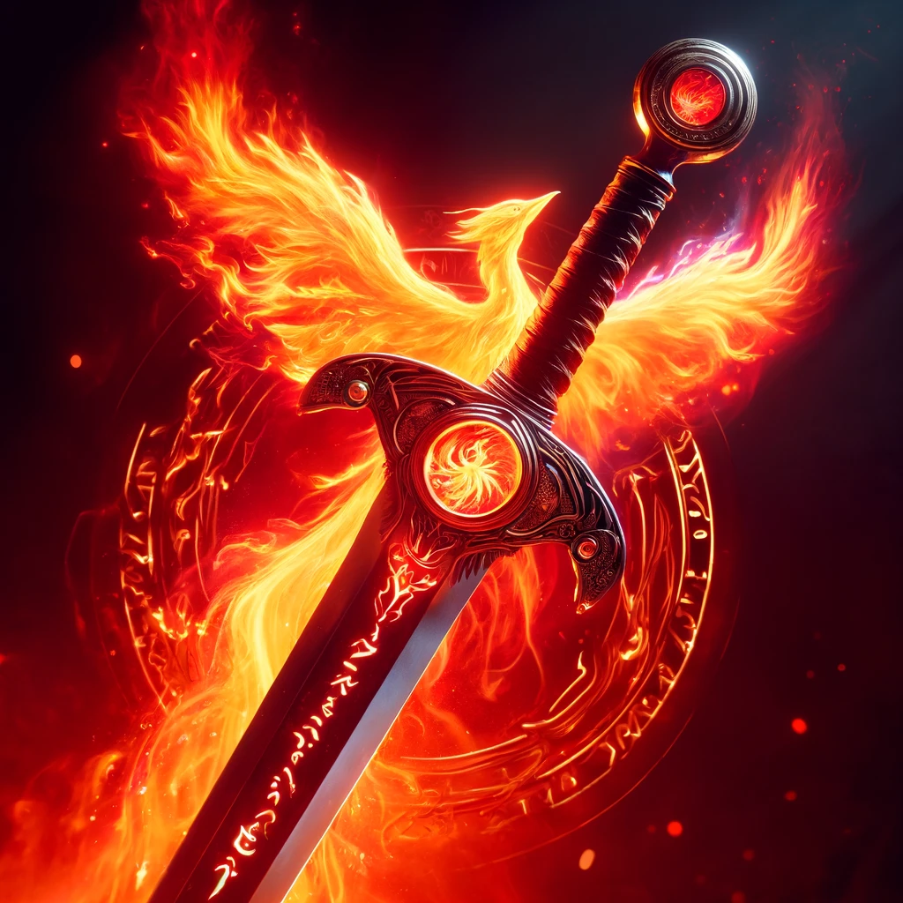

### Rune of Fjarlar-Fyr

**Combining**
- "Fjarlar" (Dwarvish for 'phoenix')
- "Fyr" (Dwarvish for 'flame')

## Effect
The sword can resurrect the wielder once if they are killed in battle. The likelihood of losing this power varies by rune location.

### Game Rules
- **Rune Rarity:** Legendary
- **Rune Difficulty:** +5
- **Effect Based on Location:**
  - **Location 1:** The sword can resurrect the wielder with a 100% chance of losing the power after use.
  - **Location 2:** 90% chance of losing the power after use.
  - **Location 3:** 80% chance of losing the power after use.
  - **Location 4:** 70% chance of losing the power after use.
  - **Location 5:** 60% chance of losing the power after use.
  - **Location 6:** 50% chance of losing the power after use.
  - **Location 7:** 0% chance of losing the power after use.

## Visual
A sword with a blade engulfed in vibrant, magical flames. The hilt is adorned with a rune circle glowing with fiery red and orange hues, symbolizing the power of the phoenix.

---

## The Legend of the Fjarlar-Fyr Rune

In the heart of the Emberpeak, a legendary smith named Thaldrin Fireforge crafted the Rune of Fjarlar-Fyr. Inspired by the eternal cycle of the phoenix, Thaldrin imbued the rune with the power to grant the wielder a second chance at life. Many warriors sought this rune, hoping to harness its miraculous power in battle.

## Description of Creator

Thaldrin Fireforge, known for his mastery of fire and forging, was a revered figure among the dwarves. His creations were unmatched, blending raw elemental power with masterful craftsmanship. The Rune of Fjarlar-Fyr became his most famous work, a testament to his skill and deep understanding of the magical forces of renewal and rebirth.

