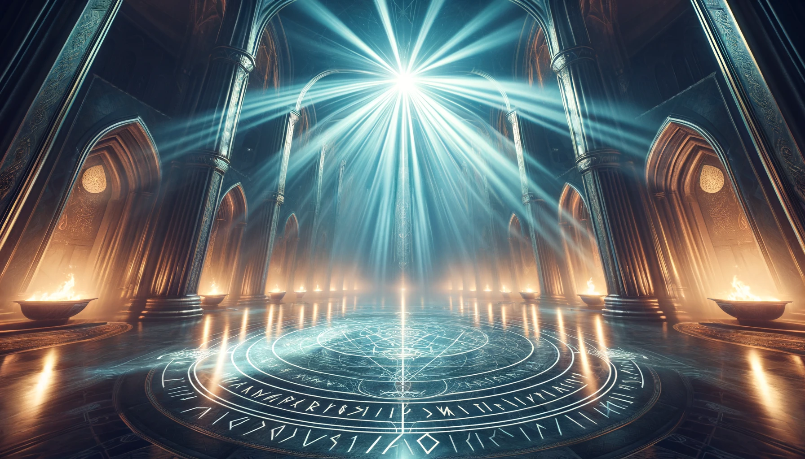
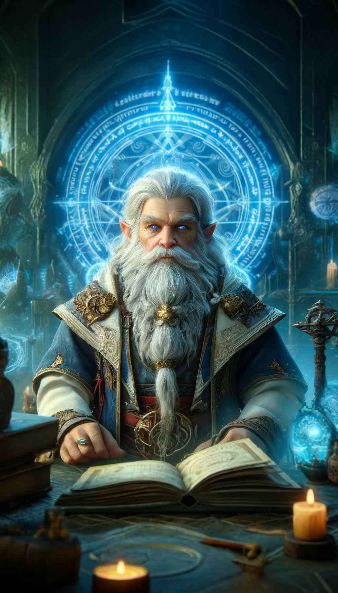
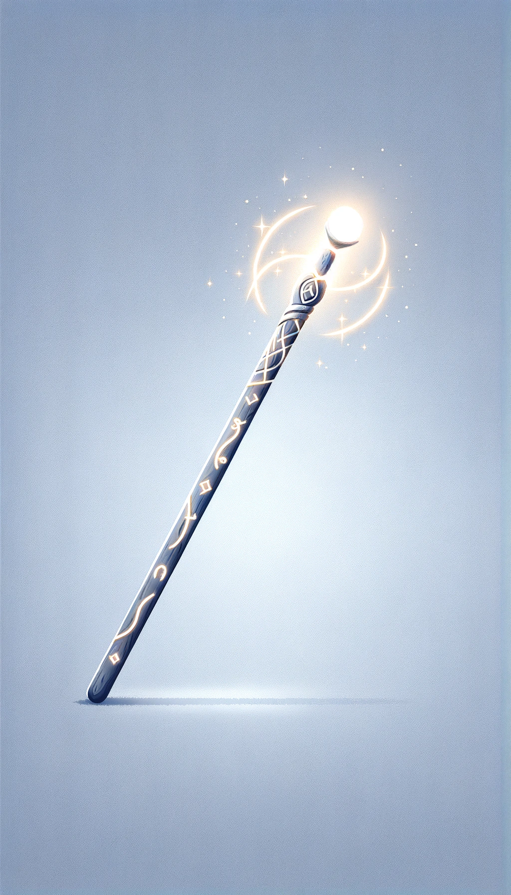

### Rune of Galdrastafur

**Combining:**
- "Galdr" (Dwarvish for 'magic' or 'spell')
- "Stafur" (Dwarvish for 'staff')

## Short Description
The staff can store a spell that can be released with an attack.

## Effect
This rune enables the staff to store a spell that can be unleashed upon hitting a target.

## Game Rules
- **Rune Difficulty:** +5 (moderate difficulty for inscribing this rune).
- **Rune Rarity:** Rare
- **Effect Variation Based on Location:**
  - **Location 1:** Store and release a level 1 spell.
  - **Location 2:** Store and release a level 2 spell.
  - **Location 3:** Store and release a level 3 spell.
  - **Location 4:** Store and release a level 4 spell.
  - **Location 5:** Store and release a level 5 spell.
  - **Location 6:** Store and release a level 6 spell.
  - **Location 7:** Store and release a level 7 spell.

## The Legend of the Galdrastafur Rune

In the mystical depths of the Arcane Conclave, an ancient order of dwarven mages known for their deep understanding of magical energies, a master rune smith named **Eldrin Spellweaver** crafted the Rune of Galdrastafur. Eldrin, renowned for his ability to merge martial and magical prowess, sought to create a weapon that could harness and release the power of spells.

His inspiration came from observing the convergence of magical ley lines at the heart of the Conclave’s sanctum. He envisioned a weapon that could absorb this raw energy and release it in controlled bursts. After months of meticulous experimentation, Eldrin succeeded in creating the Rune of Galdrastafur, allowing a staff to store and unleash spells upon impact.

This rune became a prized artifact among warrior-mages, providing them with unparalleled versatility in battle.

## Description of Creator

Eldrin Spellweaver, a legendary figure in the Arcane Conclave, was known for his innovative approach to runic magic. With piercing blue eyes that sparkled with arcane knowledge and a long, white beard that flowed like a river of wisdom, Eldrin embodied the union of intellect and mysticism. His workshop, filled with enchanted artifacts and ancient scrolls, was a testament to his lifelong pursuit of magical mastery.

## Visual Representations

### First Weapon with the Rune
A long staff with intricate rune engravings that glow with a pulsating, magical light. The staff is designed to look both sturdy and elegant, symbolizing the balance of physical strength and magical power.

### Inspiration for the Rune
A grand hall within the Arcane Conclave, where magical ley lines converge, casting a brilliant, ethereal glow over the ancient runes inscribed on the floor and walls.

### The Creator
Eldrin Spellweaver, depicted in his arcane workshop, surrounded by glowing artifacts and ancient tomes, with a focused and wise expression as he inscribes the Rune of Galdrastafur onto a staff.