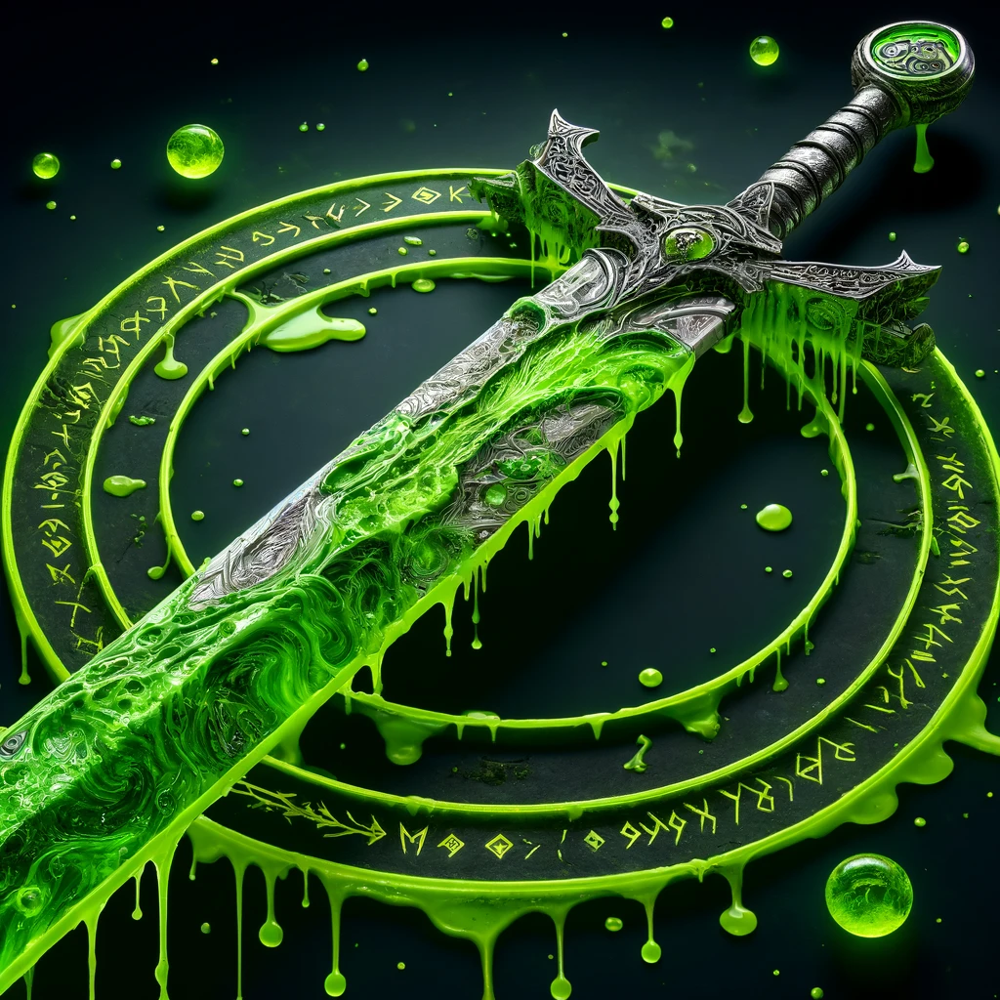
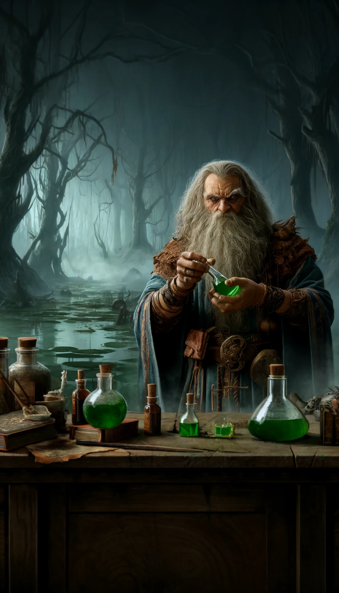

### Rune of Sluaghkarz

**Combining**
- "Sluagh" (Dwarvish for 'acid')
- "Karz" (Dwarvish for 'bite' or 'strike')

## Effect
Dealing additional acid damage and corroding armor and weapons.

### Roleplay Rules
The Dwarves forbade the creation of the Sluaghkarz Rune due to its highly destructive nature, capable of irreparably corroding armor and weapons. This corrosion posed a significant risk to the balance and fairness in battle, unlike other runes that enhance combat without causing such permanent damage. The destructive potential of acid was deemed too dangerous and unpredictable, leading to its prohibition.

### Game Rules
- **Rune Rarity:** Rare
- **Rune Difficulty:** +10
- **Effect Based on Location:**
  - **Location 1:** 
    - Causes an additional 1d6 acid damage and corroding armor (1% chance). 
    - Corroding armor effect, wearers take additional 1d2 damage every round, with 0% chance of breaking.
    - Maximum increases to 3%, uncleaned
  - **Location 2:** 
    - Causes an additional 1d8 acid damage and corroding armor (2% chance). 
    - Corroding armor effect: wearers take additional 1d4 damage every round, with 1% chance of breaking.
    - Maximum increases to 6%, uncleaned
  - **Location 3:** 
    - Causes an additional 1d10 acid damage and corroding armor (3% chance).
    - Corroding armor effect: wearers take additional 1d6 damage every round, with 2% chance of breaking.
    - Maximum increases to 9%, uncleaned
  - **Location 4:** 
    - Causes an additional 1d12 acid damage and corroding armor (4% chance).
    - Corroding armor effect: wearers take additional 1d8 damage every round, with 3% chance of breaking.
    - Maximum increases to 12%, uncleaned
  - **Location 5:** 
    - Causes an additional 2d6 acid damage and corroding armor (5% chance).
    - Corroding armor effect: wearers take additional 1d10 damage every round, with 4% chance of breaking.
    - Maximum increases to 15%, uncleaned
  - **Location 6:** 
    - Causes an additional 2d8 acid damage and corroding armor (6% chance).
    - Corroding armor effect: wearers take additional 1d12 damage every round, with 5% chance of breaking.
    - Maximum increases to 18%, uncleaned    

If the corroding armor is not cleaned, the chance of breaking increases by 1% per round.

**Additional Rule:** On a fumble, the corroding armor effect is always applied to the wielder.

## Visual
A sword with green, bubbling acid dripping from the edges. The blade has etched patterns resembling melting metal and corroded surfaces, encased within a protective rune circle glowing with a toxic green hue.

---

## The Legend of the Sluaghkarz Rune

In the marshlands of Cecia, a reclusive alchemist named Arandor the Foul discovered a potent acid that could dissolve even the strongest metals. Driven by a thirst for power, Arandor inscribed the Sluaghkarz Rune onto his blade, imbuing it with the acid’s destructive properties. Tales of his exploits spread, as his enemies' armor and weapons would corrode and fail in battle, leaving them defenseless against his onslaught.

## Description of Creator

Arandor the Foul, once a respected alchemist, turned to dark experimentation in his pursuit of ultimate power. Isolated in his marshland laboratory, Arandor delved into forbidden knowledge, eventually creating the Sluaghkarz Rune. His name became synonymous with fear, as his victims were left with little more than rust and ruin after facing his corrosive wrath. Arandor’s legacy is a testament to the dangerous allure of unchecked ambition and the transformative power of runic magic.

