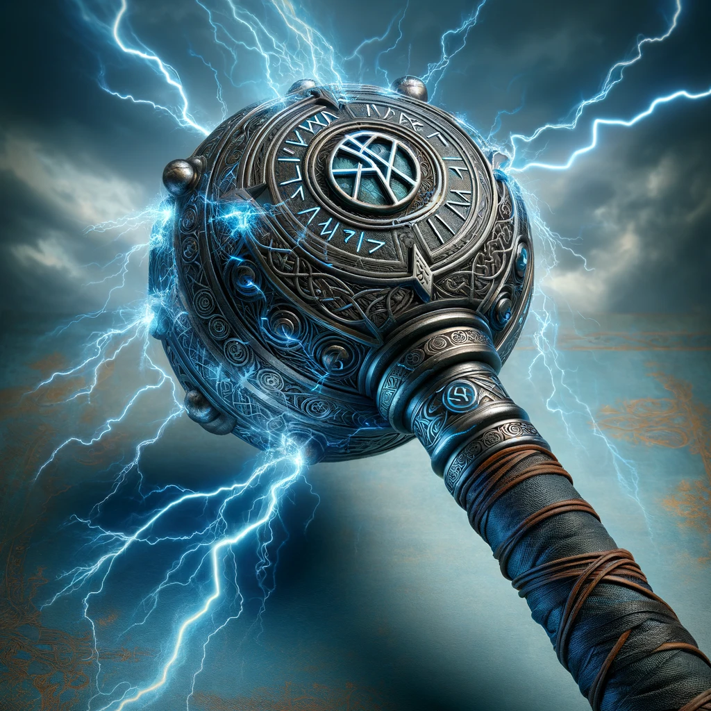
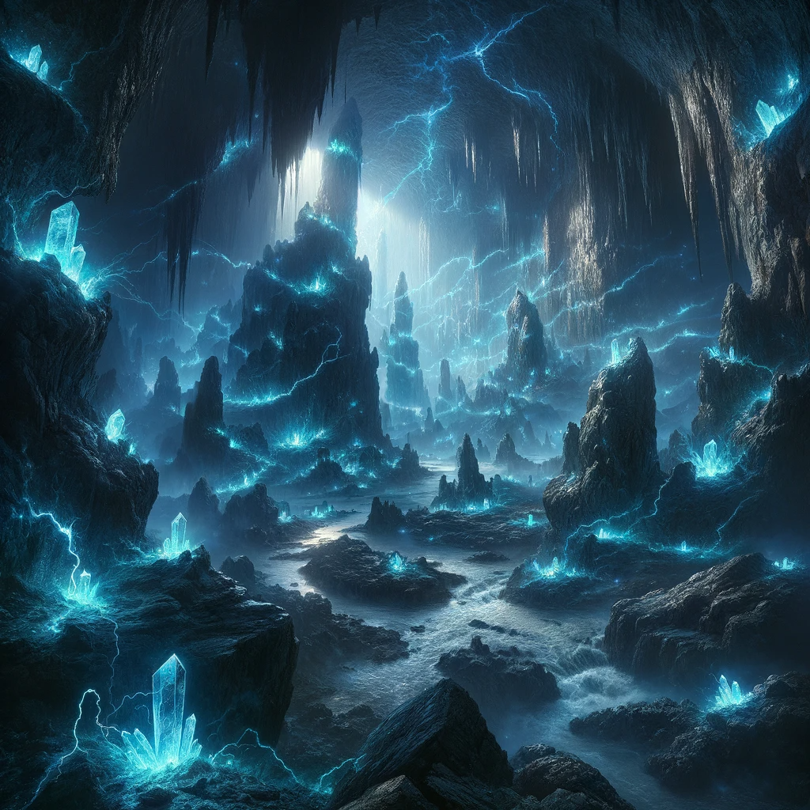
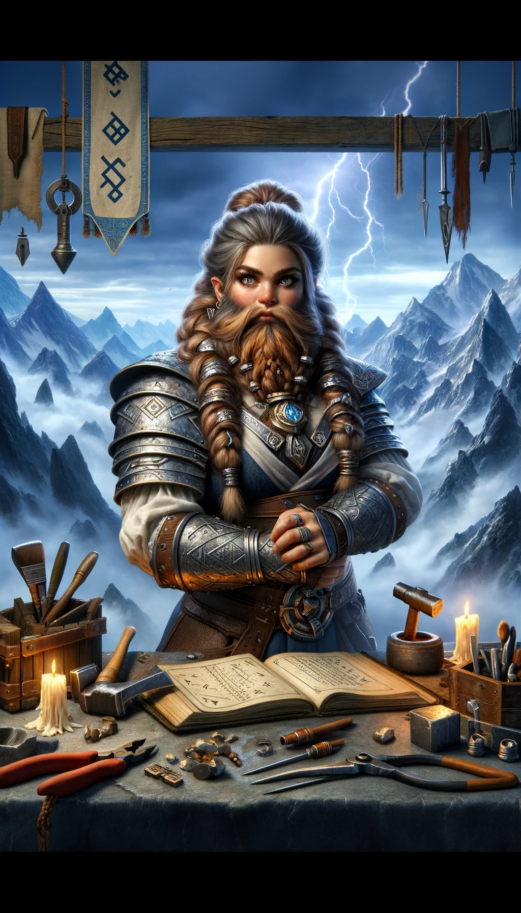

### Rune of Thurgar-Thum

**Combining**
- "Thurgar" (Dwarvish for 'thunder')
- "Thum" (Dwarvish for 'boom' or 'sound')

## Effect
The sword emits a deafening boom on a critical hit, stunning the target.

### Game Rules
- **Rune Rarity:** Uncommon
- **Rune Difficulty:** +5
- **Effect Based on Location:**
  - **Location 1:** Causes an additional 1d4 thunder damage.
  - **Location 2:** Causes an additional 1d6 thunder damage.
  - **Location 3:** Causes an additional 1d8 thunder damage.
  - **Location 4:** Causes an additional 1d10 thunder damage.
  - **Location 5:** Causes an additional 2d6 thunder damage.
  - **Location 6:** Causes an additional 2d8 thunder damage.

**Critical Hit Effect:** On a critical hit, the sword emits a deafening boom, stunning the target for one round (requires a successful Constitution saving throw to resist, DC = 10 + rune difficulty).

## Visual
A sword with a shimmering blade, surrounded by crackling arcs of blue lightning. The hilt is adorned with a rune circle glowing with an electric blue hue, symbolizing the power of thunder and sound.

---

## The Legend of the Thurgar-Thum Rune

High in the stormy peaks of the Thundercrag Mountains, the Dwarven stormcaller, Thargrim Stormsinger, sought to capture the essence of the tempest. Amidst the howling winds and crashing thunder, Thargrim inscribed the Thurgar-Thum Rune onto his blade, harnessing the raw power of the storm. With each swing, the sword would echo the might of the thunder, stunning foes with its fearsome roar.

## Description of Creator

Thargrim Stormsinger, a Dwarven stormcaller known for his mastery over the elements, was both feared and revered. His connection to the storm was unparalleled, enabling him to channel its power into his creations. Thargrim's workshop, perched atop the highest peak of the Thundercrag Mountains, was a place where the skies and earth met, and where the Thurgar-Thum Rune was born. His legacy as a master of storm magic is immortalized in the booming strikes of the Thurgar-Thum Rune.

