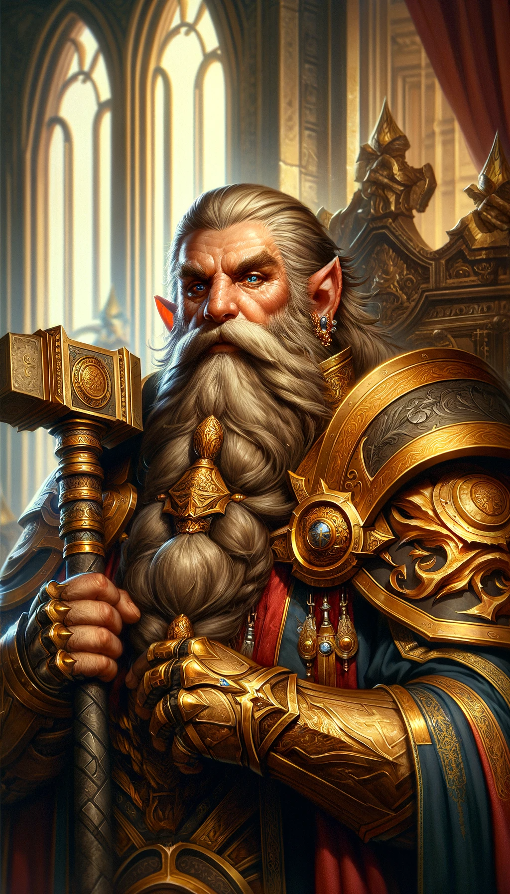
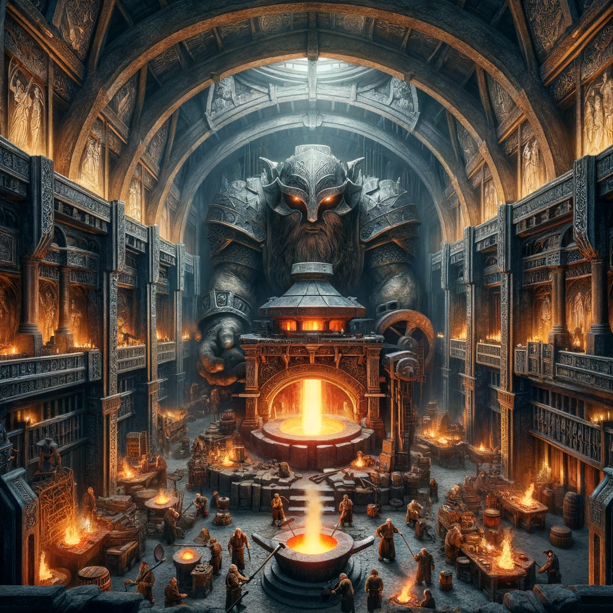

# Echoes from the Depths: The Legend of the Grand Forge in Thundar's Crest

In the elder days, when the world was young and unmarked by the passage of time, there stood a mountain, timeless and formidable. This mountain, known as Thundar's Crest, cradled within its heart a secret that would resonate through the ages: the Grand Forge, a marvel of dwarven craft, born from the dreams of King Dain Underfist. This is the tale of that forge, and the dream that united a people.

## King Dain's Vision

King Dain, of the Underfist lineage, was a ruler of vision and depth. In an era when the dwarven clans were as scattered as leaves in the wind, he dreamt of a forge that would serve as the heart of their civilization, a beacon of unity and the pinnacle of their craftsmanship. He envisioned a sanctuary where the melody of hammer on anvil would sing the anthem of their people, where the flames would narrate tales of their past and illuminate paths to their future.

King Dain, crowned in gold and iron, the first marvel of the forge, stood before his kin. His reign, marked by peace and prosperity, shaped not just his realm but the very soul of the forge. Under his guidance, the Grand Forge became a hub of innovation and artistry, unparalleled in history.

Messengers were sent to every corner of the dwarven realms, summoning the finest of their kin. Stonemasons, smiths, and artisans heeded the call, each bringing their skill and hope to the base of Thundar's Crest. Among them was Orin, the master mason, whose hands could weave stories from stone, and Baelin, the forgesmith, whose hammers had crafted tales of valor and beauty.

## The Creation of the Grand Forge

Their endeavor began, a symphony of hammers and chisels carving a new chapter in the history of their people. They uncovered a cavern, grand and awe-inspiring, as if the mountain itself had sculpted a chamber for Dain's vision. Here, they would erect the Grand Forge.

The furnace, the forge's pulsating heart, was constructed from the finest ores, coaxed from the earth's deepest veins. It stood as a shrine to the flame, a cradle for masterpieces yet to be born. And at its center was the anvil, wrought from a celestial stone, its surface echoing with the whispers of the universe.

As the forge took form, so too did unity among the dwarves. Clans, once divided, found shared purpose in the rhythm of the forge. They labored together, their sweat and aspirations blending beneath Thundar's Crest.

The Grand Hall was hewn, leading to the forge. Its walls were adorned with murals, each a narrative of the dwarves' trials and triumphs, a stone tapestry of a resilient people. The ignition of the forge was a ceremony that captivated kingdoms afar. The inaugural flame, sparked from an ancient fire, blazed to life, a symbol of hope and artistry.

The forge was more than a workplace. It was a cradle of life. Songs reverberated through its corridors, stories of fire and steel, of earth and sky. Weapons and armors, artifacts of fabled might, were birthed within its flames, each a masterpiece of design and function.

As years blossomed into centuries, King Dain's legacy endured. The forge persisted, its flames unquenched, a testament to the unyielding spirit of the dwarves. The heart of stone and fire continued to beat, a monument to a dream realized, a saga engraved in fire and whispered in the corridors of time.

This is the heritage of the Grand Forge, the essence of Thundar's Crest. It stands as a testament not just to dwarven ingenuity but to the vision of one who looked beyond stone and flame, who dreamt of harmony and mastery. In its radiance, the chronicles of the past and aspirations for the future continue to be forged, as enduring as the mountain itself.

The Grand Forge is a monumental chamber, hewn from the heart of a mountain. Its ceilings are vaulted, reaching high to accommodate the rising heat and smoke. The architecture is a blend of rugged functionality and intricate artistry, with stone arches and columns that bear carvings of dwarven myths and legends.

Dominating the center is the grand forge itself, a colossal construction of stone and iron. Its furnace is fed by bellows the size of small houses, and the fire within burns with a brilliant intensity, casting a radiant glow throughout the chamber. The anvil next to it is equally imposing, crafted from a single block of meteoric iron, its surface scarred with the memory of a thousand masterworks.

The walls of the forge are adorned with tapestries and murals depicting the dwarven gods, particularly Auric Flamekeeper, in various acts of creation. Racks holding tools and materials line the walls, each item meticulously cared for. Ingots of rare metals and exotic ores are stacked neatly, reflecting the flickering flames.

The air in The Grand Forge is alive with the symphony of creation - the roar of fires, the clanging of metal, and the rhythmic pounding of hammers. Sparks fly in beautiful arcs, illuminating the faces of the smiths, each deeply focused on their craft.

The dwarven smiths move with a practiced grace and precision, their muscles rippling under the glow of the forge. They wear heavy leather aprons and gloves, some adorned with symbols of their trade or personal achievements. The Master of the Forge, distinguishable by their ornate apron and the Flameheart Medallion, oversees the work, their eyes bright with the fire of inspiration.

The heat in the forge is almost tangible, wrapping around everyone and everything like a warm blanket. The scent of burning coal, hot metal, and the earthiness of sweat and stone permeate the air, creating an atmosphere that is both intense and sacred.

The lighting is a dramatic interplay of light and shadow, with the central forge casting a brilliant illumination and the peripheries of the chamber fading into dimness, hinting at hidden alcoves and secret chambers.

