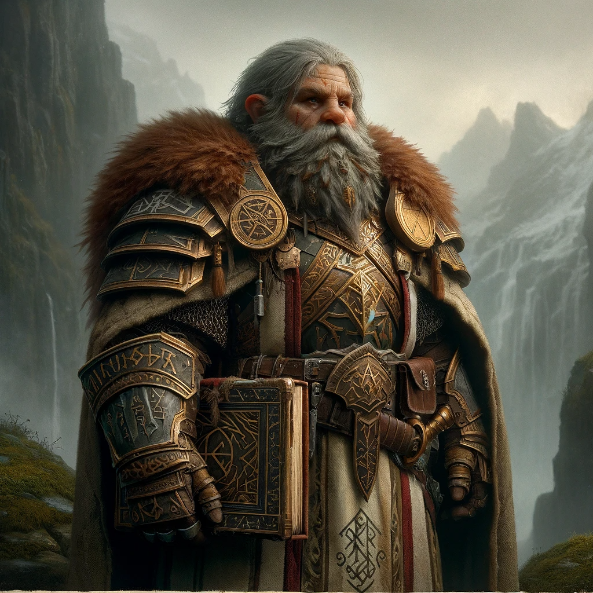

## The Inquisitors of Dagnath

The Inquisitors of Dagnath are the intrepid souls who traverse the breadth of Cecia and beyond, their purpose twofold: to reclaim the lost relics of their kind and to enforce the sacred decrees of their deity. They are the embodiment of the goddess's aspect of death, a reminder that all things must end, only to be reborn through remembrance and reverence.

Clad in armor that is a masterwork of dwarven craftsmanship, the Inquisitors are a formidable sight. Their plate is etched with runes that gleam with an inner light, each a symbol of protection and strength. The 'Iron Aegis' rune is prominent, often taking the central place on their breastplates, its lines flowing like the roots of Yggdrasil, signifying the depth and reach of their commitment.

The weapons they carry are no less remarkable. Forged in the sacred fires of Durin Shadowforge's forge, these blades and hammers are inscribed with the 'Sundering Edge' and other potent Weapon Runes. They are not mere tools of battle but symbols of the Inquisitors' authority to cut through the veils of deceit and to shatter the chains that bind the sacred relics of the past.

The Inquisitors' helms are often adorned with motifs that speak of their role as seekers of truth and protectors of the dwarven way. The visages of their helms might be crafted to resemble the stoic faces of their ancestors, a tribute to the spirits that guide them in their quest.

Each Inquisitor carries with them a tome, bound in leather and clasped with iron, wherein they record their findings and the tales of their journeys. These tomes are often marked with the 'Wordkeeper' rune, ensuring that the words within are preserved against the ravages of time and decay.

The path to becoming an Inquisitor is arduous, requiring not only a warrior's prowess but also a scholar's wisdom. Candidates are tested in the field and the library, and only those who can demonstrate a profound understanding of both the martial and the historical are elevated to this esteemed role.

Inquisitors are often seen as solitary figures, for their mission is a lonely one. Yet, in their solitude, they carry with them the weight of their people's hopes and the solemn duty entrusted to them by Dagnath. They walk the line between the living and the dead, ensuring that the dwarves of the Iron Hills never forget the glories of their past nor the duties of their future.