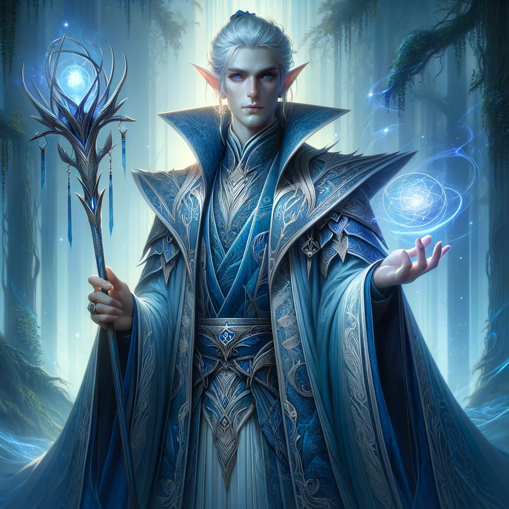
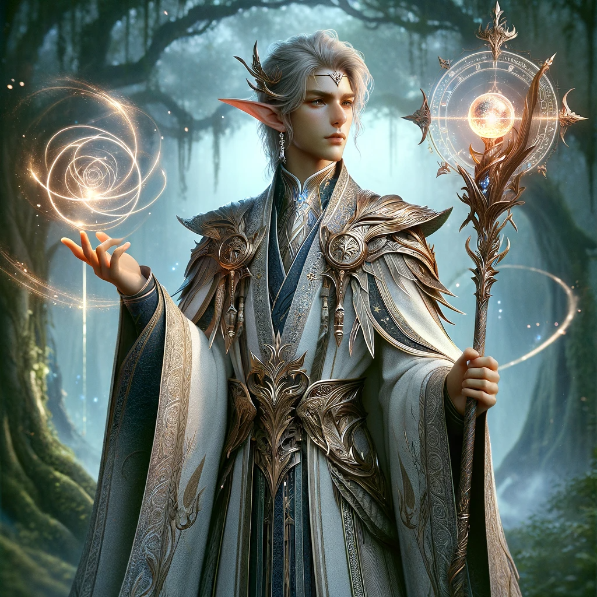

# Akh'Faer – 'Army of Art'

The Akh'Faer serve as the magical diplomats for the Elven community. They are experts in mediating conflicts involving magical elements and advising on magical treaties. Their skills extend to magical diplomacy, cultural sensitivity, and international missions. They also participate in magical councils and specialize in magical mediation and conflict resolution.

Internally, they act as the ultimate authority on magical usage within Elven territories, ensuring ethical and responsible use of magic. Globally, they serve as peacekeepers, balancing national interests with global magical stability.

Their skill set includes magical prowess, artistic mastery, and a specialized curriculum. They are deployed for diplomatic missions and grand events, specializing in artistic magic.

They operate under a strict code of conduct that emphasizes elegance, cultural preservation, and ethical use of magic. Their diplomatic etiquette is comprehensive, covering everything from protocol mastery to magical ethics.

In a military context, they focus on magical warfare, providing magical support, reconnaissance, and offense. Their roles include spell disruption and magical shielding among others.

In essence, the Akh'Faer are not just diplomats but magical diplomats, uniquely qualified for their roles due to their deep understanding of magical arts and lore. They are invaluable in both peacetime and wartime, serving as a bridge between the magical and diplomatic worlds.

## Diplomatic Roles of the Akh'Faer:
AkhFaer_Blue

### 1. Act as Mediators in Conflicts Involving Magical or Mystical Elements
- The Akh'Faer are often the first point of contact in any magical dispute, serving as mediators who bring a wealth of magical knowledge to the table.
- They are trained in ancient elven techniques that allow them to neutralize magical threats and even reverse spells.
- Their role as mediators is not just a job but a calling, a way to maintain the delicate balance of magical energies in the world.

### 2. Advisors on Matters of Magical Treaties and Alliances
- The Akh'Faer serve as the magical think-tank for elven leaders, advising them on the intricacies of magical treaties and alliances.
- They also serve as the guardians of these magical treaties, constantly monitoring the magical currents to ensure that all parties are adhering to the terms.
- Their role as advisors is seen as a form of service to the greater elven community.

### 3. Magical Diplomacy
- Experts in the art of magical negotiation, the Akh'Faer are often sent as envoys to other magical societies.
- They are also skilled in the use of magical artifacts that can be used in negotiations.
- Their expertise in magical diplomacy is seen as a unique skill set, one that has been honed through centuries of practice and study.

### 4. Cultural Sensitivity
- The Akh'Faer are trained in the magical traditions of other races and nations, allowing them to act as cultural bridges in negotiations.
- This cultural sensitivity allows them to navigate the complex web of magical etiquette that often accompanies international magical negotiations.
- Their role as cultural mediators is seen as a form of magical diplomacy, one that acknowledges the rich diversity of magical traditions in the world.

### 5. International Missions
- The Akh'Faer are often sent on international missions to forge alliances or negotiate treaties.
- They are often accompanied by a retinue of magical experts who can provide on-the-spot advice and assistance.
- These international missions are seen as a form of magical ambassadorship, a way to represent the best of elven magical tradition to the world.

### 6. Magical Councils
- The Akh'Faer represent elven society in various councils and organizations focused on magical governance.
- They are also responsible for ensuring that elven interests are represented in these councils, advocating for policies that benefit the elven community.
- Their participation in these councils is seen as a form of magical stewardship, a way to ensure that magical governance is fair and just.

### 7. Magical Mediation
- Specializing in magical conflict resolution, the Akh'Faer often serve as neutral arbitrators in disputes that involve magical elements.
- They are also skilled in the use of magical techniques that can facilitate communication between disputing parties, such as empathy spells or truth serums.
- Their role as magical mediators is seen as a form of magical justice, a way to ensure that all parties have a fair and equal say in the resolution of disputes.

### 8. Arcane Alliances
- The Akh'Faer are experts in forming and maintaining alliances based on mutual magical interests.
- They are also responsible for maintaining these alliances, regularly meeting with allied parties to ensure that the terms of the alliance are being met.
- Their role in forming and maintaining arcane alliances is seen as a form of magical diplomacy, one that seeks to create a network of magical allies who can support each other in times of need.

### 9. Conflict Resolution
- The Akh'Faer undergo specialized training in both magical and non-magical conflict resolution.
- They are also trained in the use of magical artifacts that can aid in conflict resolution, such as peace talismans or harmony crystals.
- Their role in conflict resolution is seen as a form of magical peacemaking, a way to resolve disputes through a combination of magical and non-magical means.

## Magical Regulation and Global Policing:
### Internal Policing: 
Within their own Elven territories, the Akh'Faer act as the ultimate authority on magical usage. They are responsible for defining what constitutes "powerful magic" and ensuring that it is used responsibly and ethically. This involves monitoring magical activities, investigating any unauthorized or dangerous magical practices, and taking corrective actions, which could range from magical containment to legal prosecution. Their role is not just to police but to educate, ensuring that the magical community within the Elven territories understands the implications and responsibilities that come with wielding powerful magic.

### Global Policing: 
The Akh'Faer's jurisdiction isn't limited to their homeland; they also act as a sort of global police force for magical activities. They monitor magical practices in other nations and intervene when they detect the use of magic that could pose a threat to the Elven interest  or violate magical laws. Their interventions are often diplomatic, leveraging their magical and political acumen to resolve issues without resorting to conflict. However, they are will taking decisive action when the situation demands it.

### Balancing Act: 
The Akh'Faer's role as global peacekeepers is a delicate one. They must balance their own national interests with the broader goal of maintaining global magical stability. This often involves complex negotiations and alliances, sometimes even with traditional enemies. Their deep understanding of magic and diplomacy makes them uniquely qualified for this challenging role, and their actions are often guided by a long-term vision for global magical harmony.

### Ethical Considerations: 
The Akh'Faer are also the moral compass when it comes to the use of powerful magic. They set the ethical guidelines and ensure that magic is not used for malevolent purposes. This involves a deep understanding of both magical ethics and the potential consequences of magical actions, making their role not just regulatory but also philosophical.

### Skills:
- **Magical Prowess:** Highly skilled in various forms of magic, particularly those that can be integrated into artistic performances.
- **Artistic Mastery:** Experts in the arts, from music and dance to painting and sculpture.
- **Curriculum:** Emotion Calming Spells: Spells that can diffuse tension and calm heightened emotions, Negotiation 

### Deployment:
- **Diplomatic Missions:** Frequently sent on diplomatic endeavors to display elven power and negotiate terms.
- **Grand Events:** Perform at significant elven ceremonies and festivals to showcase their magical and artistic abilities.

### Specialty:
- **Artistic Magic:** Unique to this sub-branch, they specialize in combining art and magic to create mesmerizing performances that serve both entertainment and diplomatic purposes.

## Codes of Conduct:
- **Elegance:** Always maintain a high level of elegance and poise during performances and diplomatic missions.
- **Cultural Preservation:** Committed to preserving and promoting elven art and magical traditions.
- **Magical Studies:** Rigorous academic and practical training in various schools of magic.
- **Combat Simulation:** Regular training in simulated battle conditions to hone their magical skills.
- **Precision:** Every action is calculated for maximum efficiency and minimum risk.
- **Secrecy:** Maintain the utmost secrecy before, during, and after operations to protect the techniques and spells used by the unit.
- **Discipline:** Operate under a strict code of discipline to ensure the responsible use of powerful magic.
- **Ethical Use:** Committed to the ethical use of magic, avoiding spells that cause unnecessary suffering.
- **Neutrality:** Maintain a neutral stance in conflicts to serve as effective mediators.
- **Confidentiality:** Uphold the highest standards of confidentiality in diplomatic matters.
- **Personnel:** We have a well-trained diplomatic corps.
- **Cultural Sensitivity:** We are educate on the cultural norms and taboos related to magic in different societies.

#### Diplomatic Etiquette:
 - **Protocol Mastery:** Formalities and protocols of diplomatic engagement, including greetings, attire, and ceremonial procedures.
 - ***Language Skills:** We learn languages and dialects of key allies and adversaries to facilitate effective communication.
 - **Magical Treaties:** Introduction to the laws and regulations governing magical treaties and alliances.
 - **Arcane Etiquette:** The proper conduct when dealing with magical entities and artifacts.
 - **Negotiation Skills:** We know negotiation techniques, both magical and non-magical.
 - **Cultural Studies:** We are aware of the magical and cultural traditions of other races and nations.
 - **Magical Law:** We are the  governing laws on use of magic.
  - **Consent and Transparency:** Ensure that all parties involved are aware of the magical elements being introduced into diplomatic proceedings.
 - **Non-Coercion** Prohibit the use of magic for manipulating or coercing diplomatic parties into agreements against their will. (By Non-Elven Parties)
 - **Misuse of magic** Prevent the misuse of magic, regularly  the ethical guidelines for the use of magic, Hold magical practitioners accountable for their actions.
 - **Magical Countermeasures:** Neutralize any lingering magical effects caused by the violation, Akh'Faer mages may be deployed to counteract or dispel any magical spells or artifacts involved in the violation.
 - **Negotiation Skills:** We master the art of negotiation, both magical and non-magical.
 - **Emotional Intelligence:** We understand and manage emotions in a diplomatic context.
 -**Magical Ethics:** We understand the ethical implications of using magic in conflict resolution. know more about any specific module or another aspect of Akh'Faer's training?

## Role:

### Diplomatic Role:
Members of the Akh'Faer caste are more then just diplomats; they are magical diplomats. Their deep understanding of magical arts and lore allows them to negotiate and mediate with a unique perspective. They are often called upon to resolve conflicts that have magical or mystical elements, making them invaluable in international diplomacy. Many Members of the Akh'Faer caste Serve as cultural ambassadors, showcasing the richness of elven art and magic to other races and societies.

During diplomatic missions, they employ powerful spells to demonstrate the might of Elven magic. These spells are more just for show; they serve as a strategic display of strength, subtly reminding other nations of the Elves' magical prowess. This often places them in a position of advantage during negotiations.

### Display of Magical Superiority:

#### Grand Arcane Exhibitions:
The grand displays of magic by the Akh'Faer serve multiple purposes. While they are primarily used to showcase the might of Elven magic, they could also serve as a form of psychological warfare. The sheer scale and complexity of their magical displays could serve to intimidate potential adversaries and boost the morale of Elven troops and allies.

  - **Establishing a position of strength** To showcase the advanced magical capabilities of the Elven nation, thereby establishing a position of strength in diplomatic 
  - **Magical Demonstrations** Performing complex spells or summoning magical entities as a part of diplomatic ceremonies.

    
    

###

### Intelligence Gathering: 
While the Akh'Faer are skilled in gathering intelligence through magical means, they could also collaborate with other military castes specialized in reconnaissance and espionage. Their role could be to validate and interpret the magical aspects of the intelligence gathered, ensuring that the Elven military has a well-rounded understanding of the situation

### War-time Role:
In times of conflict, the Akh'Faer transition from their diplomatic roles to become magical warriors. They employ their deep understanding of their enemies, gained during peacetime negotiations, to devise effective war strategies. Their mastery of magic becomes a critical asset in both offensive and defensive operations.

They are also responsible for gathering intelligence about enemy forces. Using advanced scrying spells and magical familiars, they provide real-time data that is crucial for strategic planning. Their unique blend of magic and artistry allows them to create illusions and diversions, disorienting the enemy and providing their forces with a tactical advantage.

- Display of elven power through artistic and magical performances, often used in diplomatic missions and grand events.

# Role of Akh'Faer within the Elven Military
Specialized in military focused on the mastery and application of magical arts in warfare. Unlike other castes that may specialize in reconnaissance and open combat, Akh'Faer 
is dedicated to magical warfare, serving as the primary source of magical support, reconnaissance and offense for the elven forces.
We adapting to the demands of war while maintaining their unique magical expertise, Akh'Faer proves to be an invaluable asset to the Elven military during times of conflict.

### Roles and Responsibilities:
 - **Spell Disruption:** Identify and neutralize enemy spells that could harm allied forces or hinder mission objectives, Utilize specialized counterspells and magical artifacts to break enemy spells.
 - **Magical Shielding:** Provide magical barriers that protect allied forces from enemy magical attacks, Use advanced warding spells and glyphs to create protective shields around key areas or units.
- **Magical Interception:** Intercept and redirect enemy magical attacks. Use specialized spells that can capture and redirect magical energy.
- **Curriculum:** Spell Identification: recognize various types of spells based on their magical signatures.

#### Combat specialty:
 - **Magical Artillery:** Specialize in long-range magical attacks that can decimate enemy formations.
 - **Counter-Magic:** Experts in identifying and nullifying enemy spells and magical traps.
 - **Provide magical support** Barriers, and offensive spells, to other castes during combat.
 - **Elemental Mastery:** Experts in manipulating the elements for both offensive and defensive purposes.
 - **Magical Support:** Primarily deployed to provide magical support to other elven castes.
 - **Strategic Locations:** Positioned at key points on the battlefield to maximize their magical influence.
 - **Scout enemy positions:** knowing strengths, and weaknesses. Utilizing advanced scrying spells and magical familiars to gather real-time intelligence.
 - **Familiar Scouts:** Magical creatures trained to gather intelligence.

#### Reconnaissance specialty:
 - **Identity high value target:** Identity and insights about high-value targets.
 - **Strategic Planning:**  To offer magical insights into battle strategies. Using divination and other magical means to predict enemy movements and intentions.
 - **Covert Missions** Small teams of highly trained mages are deployed deep into enemy territory.

### Arcane Espionage:
 - **Gather intelligence** To gather intelligence on other nations' magical capabilities and intentions.
 - **Psychological Impact:** Establish a psychological edge in diplomatic negotiations through the display of overwhelming magical power.
 - **Inspiration:** Inspire awe and respect for the Elven nation's magical heritage and capabilities.

## Resources:

### Magical Resources:
 - **Arcane Libraries:** Comprehensive repository of magical knowledge and spells, regularly updated libraries with restricted access to authorized personnel.
 - **Magic items** 
 - **Magical Components** : Rare herbs, minerals, and other exotic components used in spellcasting, potion brewing, and scroll scribing.
 - **Scrying:** For long-range viewing, 

### Conventional Resources:
   - **General currency:** Trade, paying mercenaries, and funding expeditions.
   - **Vaults:**  Vaults filled with gold and platinum coins, often enchanted for extra security.
   - **Fleet of Ship:** A fleet of both military and civilian ships.
   - **Gem Reserves** Collections of precious and semi-precious gems, some of which are magically imbued. Used in spell components, magical item creation, and as high-value trade items.

### Emergency Reserves:
 Resources set aside for unforeseen circumstances.  A portion of both magical and conventional resources is kept in reserve.

## Leader of Akh'Faer

