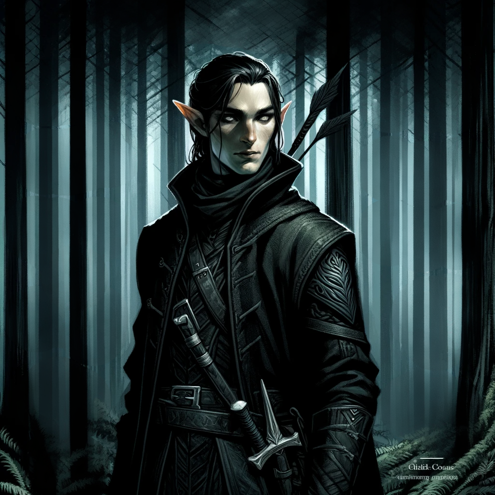
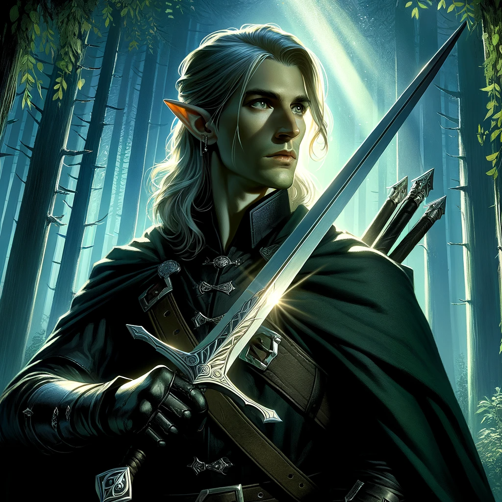

# Shilmista – 'Forest of Shadows'

## Role:
### Function:
- Specialize in stealth operations, ambush tactics, and covert missions.
- Act as scouts and intelligence gatherers for the elven military.

## Skills:
- **Stealth Mastery:** Experts in moving silently and blending into their surroundings.
- **Shadow Manipulation:** Skilled in the magical art of manipulating shadows for various purposes, including concealment and attack.

## Deployment:
- **Covert Missions:** Primarily deployed for covert operations, including reconnaissance and assassinations.
- **High-Risk Areas:** Often sent to areas where conventional forces would be too noticeable or ineffective.

## Specialty:
- **Ambush Tactics:** Specialize in setting up and executing ambushes, making them highly effective in guerrilla warfare.
- **Last Resort:** If you see them, it's probably too late; they are the last line of defense and often the last thing an enemy sees.

## Training:
- **Stealth Training:** Rigorous training in the arts of stealth, evasion, and silent killing.
- **Magical Training:** Specialized training in shadow magic to augment their natural stealth abilities.
- **Simulated Scenarios:** Regularly train in simulated environments to perfect their ambush tactics.
- **Adaptability:** Taught to adapt their tactics based on the situation and enemy behavior.

## Codes of Conduct:
- **Silence:** Operate under a strict code of silence to maintain the secrecy of their missions.
- **Loyalty:** Unwavering loyalty to their clan and the elven society at large, willing to give their lives for the mission.

# Tactics of Shilmista – 'Forest of Shadows'

## Overview:
- **Ambush:** Specialize in ambush tactics designed to incapacitate or eliminate targets swiftly and silently.
- **Reconnaissance:** Gather detailed information about the target area and enemy movements.
- **Timing:** Choose the optimal time for the ambush, often during the night or in conditions that provide natural cover.
- **Surprise Element:** Utilize shadow magic to create illusions or distractions.
- **High-Impact Attacks:** Use powerful spells or ranged attacks to deal initial high damage.
- **Adaptability:** Always prepared to adapt strategies based on real-time intelligence.
- **Efficiency:** Aim to achieve objectives with minimal risk and resource expenditure.

#### Follow-Up:
- **Quick Elimination:** Swiftly move in to eliminate any remaining threats.
- **Retreat:** Use shadow magic for quick and silent retreat, leaving no traces behind.

### Hit and Run:
- **Objective:** Inflict maximum damage with minimal engagement.
- **Method:** Quick strikes followed by immediate withdrawal.

### Guerilla Warfare:
- **Objective:** Harass and weaken the enemy over time.
- **Method:** Small-scale, surprise attacks on enemy supply lines and outposts.

### Diversion:
- **Objective:** Divert enemy attention away from the main objective.
- **Method:** Use illusions and other distractions to mislead the enemy.

### Survival:
- **Foraging:** Knowledge of edible plants and how to find water.
- **First Aid:** Basic knowledge of first aid and the use of natural remedies.

### Covert Missions:
- **Objective:** Gather intelligence, sabotage, or eliminate high-value targets.
- **Method:** Small teams or solo agents are deployed deep into enemy territory.

### Reconnaissance:
- **Objective:** Map out enemy positions, strengths, and weaknesses.
- **Method:** Scouts are sent to observe and report back, often using magical means for communication.

### Defensive Operations:
- **Objective:** Protect elven territories from invasion.
- **Method:** Utilize natural barriers and magical wards to create a defensive perimeter.

# Training and Codes of Conduct of Shilmista – 'Forest of Shadows'

## Basic Training:
- **Stealth:** Rigorous training in moving silently and blending into various environments.
- **Combat:** Basic training in both ranged and melee combat, focusing on quick and silent takedowns.

### Advanced Training:
- **Shadow Magic:** Specialized courses in manipulating and controlling shadows.
- **Illusion Magic:** Training in creating and maintaining illusions for various purposes.

### Specialized Training:
- **Ambush Tactics:** Simulated environments for practicing ambush scenarios.
- **Survival Skills:** Wilderness survival courses, including foraging and first aid.

## Codes of Conduct:
- **Efficiency:** Aim for maximum impact with minimum resources.
- **Secrecy:** Maintain the utmost secrecy before, during, and after the ambush.
- **Precision:** Every action is calculated to achieve maximum efficiency.
- **Silence:** Operate under a strict code of silence to maintain the secrecy of their missions.

### Operational Codes:
- **Silence:** Maintain a strict code of silence before, during, and after missions.
- **Precision:** Every action is calculated for maximum efficiency and minimum risk.

### Ethical Codes:
- **Loyalty:** Unwavering loyalty to the elven society and their specific clan.
- **Integrity:** Uphold the values and traditions of the elven society, even when operating in secret.

### Tactical Codes:
- **Adaptability:** Be prepared to adapt to changing circumstances.
- **Resourcefulness:** Make optimal use of available resources, including natural elements and magical artifacts.

### Post-Mission Codes:
- **Debriefing:** Detailed reporting of the mission to higher authorities.
- **Accountability:** Take responsibility for any actions taken during the mission, whether successful or not.

## Tools and Resources:

### Magical Portals:
- **Objective:** Quick insertion and extraction.
- **Method:** Utilize magical portals for rapid deployment and retreat.

### Animal Companions:
- **Objective:** Assist in various tasks like tracking and carrying equipment.
- **Method:** Trained magical beasts and familiars.

### Tools:
- **Shadow Blades:** Magical weapons that can phase through defenses.
- **Smoke Bombs:** Magical smoke bombs for quick concealment and escape.
- **Traps:** Utilize magical and mechanical traps to immobilize or eliminate targets.

# Skills of Shilmista – 'Forest of Shadows'

## Physical Skills:

### Stealth:
- **Silent Movement:** Trained to move silently across various terrains.
- **Camouflage:** Expertise in using natural elements for concealment.

### Combat:
- **Close-Quarters Combat:** Skilled in hand-to-hand combat and the use of short-range weapons like daggers.
- **Ranged Combat:** Proficient in the use of ranged weapons like throwing knives and shortbows.

## Magical Skills:

### Shadow Manipulation:
- **Shadow Meld:** Ability to blend into shadows, making them nearly invisible.
- **Shadow Strike:** Use shadows to strike enemies from a distance.

### Illusion Magic:
- **Disguise:** Ability to create illusions to disguise their appearance.
- **Distraction:** Create illusions to distract enemies during operations.

## Special Skills:

### Reconnaissance:
- **Tracking:** Skilled in tracking both magical and non-magical entities.
- **Information Gathering:** Expertise in gathering crucial information without being detected.

Leader of Shilmista
